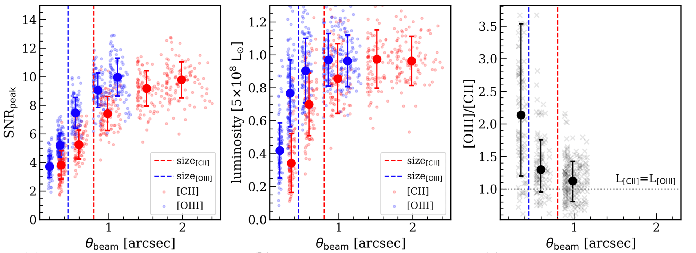

[toc]

# Astro-ph in 2020

Ideas come from reading! My daily reading plan, keep reading 💪🏻

## The nature of faintest dusty star-forming galaxies

Manuel Aravena et al. \>\>\>
[astro-ph](https://arxiv.org/abs/2006.04284)

Some tentative evidences indicate the faint sub-millimeter galaxies (SMG) are different from the bright SMG find by previous single-dish survey (like SCUBA, SCUBA-2). This paper takes advange of the deep ALMA observation on the Hubble Ultra Deep Field to study the general properties of the faint sub-millimeter galaxies.  

They found the median redshift of the faint SMG (black lines in Fig.  1-1) are lower than the bright ones (magenta solid line is the SMG in SCUBA-2), which tend to be more low redshift normal galaxies. They also has a lower molecular mass than the pre-selected star-forming galaxies in similar reshift range (see Fig 1-2). Most of the galaxies are within the main sequence, but some of them are above or below the main sequence. Based on the 0.4dex boundary of the star-forming main sequence, the author also find their sample typically counts all the molcular gas budget of redshift 1-3 and most of the molecular gas is in the main sequence galaxies.

This kind of blind survey can be more unbiased in selecting the fainter
galaxies. And their multi-band data provide valuable information about
this faint SMGs. Even though it is hard to reach more deep to micro
Jansky SMGs in such deep field survey, but it is still possible for
ALMACAL project

## HI emission at redshift one

Aditya Chowdhury et al. \>\>\>
[nature](https://doi.org/10.1038/s41586-020-2794-7)

HI in galaxies of local Universe can be directly observed, and z \>2 could be detected from damped Lyman alpha absorption. In between, due to the low spontaneous emission probability and the low coulumn density, HI can be hardly observed. This makes valid HI data absent during the peak star formation activity of the Universe. But in the other side, HI is critical to determine why cosmic star formation halted globally after redshift one.

The authors have stacked 7653 star-forming galaxies between 0.74\<z\<1.45 to detect the average HI mass density at this epoch. The stacked image is show in Fig. 1-1 and the spectrum in Fig. 1-2. A 4.5 sigma signal have been detected. Based on this detection, a average of 1.19x10^10^ Msun have been inferred, which corresponding a atomic gas depletion time of 1.54±0.35 Gyr. Comparing to the time of local star-forming galaxies, it indicates the shortage of atomic supply from the inter-galactic medium could be the main reason of the cosmic star formation cessation.

This work can be regard as model about how to stack large sample of weak signal. It relies on many details, like the weighting, the resolution, the primary beam and other possible contamination. In their supplementary, they also show how to check the stacking is reasonable done. It is a good reference for stacking.

## Ubiquitous molecular outflow in distant, massive dusty galxies

Justin S. Spilker et al. \>\>\>
[astro-ph](https://arxiv.org/abs/2010.12590)

OH 119𝜇m absorption feature has been widely used to trace the molecular gas outflow in nearby quasars. The authors in this paper applied this method to trace the molecular outflow of strong lensed z\>4 massive dusty galaxies. These galaxies are very bright, thus make the absortion detectable. They found that almost all of their sample have securely detected molecular outflows(\<73%).

Fig 1 is their detected OH doublet obsorptions (in red line) and the best fittings (in navy lines). Since the OH absortion is very complex, they also plot the \[CII\] (in black line) in the bottom as a reference.  More interesting, with the source have securely detected molecular outflow, they also test the reliability of \[C II\] as the molecular outflow tracer. In the Fig 2, they found all the indivitual four galaxies has OH outfow without any strong broad \[C II\] winds. Neither for the stacked one. It lead to the doubt about the \[C II\] as a reliable molecular gas tracer for high-z galaxies.

The high outflow detecting rate in their sample can be reasonable as they are all the most bright dusty starburst galaxies. I think the most interesting part is the comparison between OH and \[C II\] as the molecular gas tracer. It also offers a convincive support for another paper today [2010.14875](https://arxiv.org/pdf/2010.14875.pdf), which stacked all the z\<6 quasars \[C II\] spectra, and found no evidence of high-velocity outflow 

## A globally dense star-forming intersterllar medium in z=2.6 lensed dusty
galaxy

M.J. Doherty et al. \>\>\> [astro-ph](https://arxiv.org/abs/2010.15128)

The fine structure line of \[N II\] can be used to derive the electron density of interstellar medium. In Milky Way, this method has revealed a golbal electron density of 30 cm^-3^, with some small intense star-forming region two magnitude higher density. In nearby starburst systems, a higher electron density also reported. This work carries this kind of measurement to the high-z submillimeter galaxy 9io9, take advange of the lensing effect to resolve the two \[NII\] fine structure lines.  

This work takes the advantage of the lensing effect to make the directly detection of \[NII\] at z\~2.6 possible. Fig 1 shows their continuum and \[NII\] image and their recovered image. Besides \[NII\], they also have previously detected CO(4-3) and CI(1-0), all the three emission lines show horned profile. This may indicate all of them comes from the rotating disk. Fig 2 plots the relation between the \[NII\] double line ratio and the CO(4-3)/CI(1-0) ratio. 9io9 has the similar electron density compaing to local starburst system, but it also has a higher dense molecular ratio. It possible indicate one standing out characteristic of luminous high-z starburst is their predominant dense molecular gas.

## Fast magnetic field amplification in distant galaxy clusters

Gabriella Di Gennaro \>\>\> [astro-ph](https://arxiv.org/abs/2011.01628)

The initial magnetic field is supposed to produced by relative electron seeds or galactic outflow, and then amplified by small scale turbulent.  Detection of the magnetic field at early Universe can be helpful to understand how the magnetic field forms and envolves. Several uG magnetic field has been found in nearby Galaxy clusters but it is hard to detect the magnetic field at higher redshit. Based on the synchrotron 1.5 GHz emission and the cluster mass, the authors found the distant (z\~0.7) galaxy clusters share the similar magnetic field as the local clusters in the same mass range, which indicates the amplication of the can be supprisely efficient.

The work benefit from the SZ effect and the long wavelength LOFAR observation. The SZ-signal can be used to constrain the cluster total mass, and the sample were selected from Planck SZ2 catalogue. The 1.4GHz synchrotron luminosity derived from LOFAR two-meter sky survey, by assuming a 𝛼=-1.5 spectral index. The LOFAR image of the clusters are showed in Fig 1, and the correlation of 1.4GHz luminosity and cluster mass show in the left pannel of Fig 2. The dashed line with different color show the prediction of different magnetic field. Best fit one is the black one with 2 uG magnetic fied. At the right pannel of Fig 2, they showed the amplification of magnetic field under different initial field and different Reynolds number. The white region can be the most possible parameter space.

I have two doubts about the this paper. The first one is about the their images, the large scale radio emission is showed in lower resolution, if you look their original one, it seems that the larger scale emission is from the smoothing process, not the real one; the second doubts is about the 1.5GHz luminosity, they are not measure directly, but extrapolated from 2-meter observation. How reliable about this assumption?

## Massive galaxies at 3 \< z \< 6

Z. Cemile Marsan \>\>\> [astro-ph](https://arxiv.org/abs/2010.04725)

Massive galaxies show totally different properties at different comological time. In the local Universe, these galaxies are dominately red and ellipically shaped; at z\~2, half of them already run out their cold gas and were dominated by old stellar population; at z\~3, this population is more likely found in dusty, star-forming galaxies with very compact shapes. This general picture revels the rapid evolution of the most massive galaxies in the Universe, thus it is also instersting to find their ancestors at higher reshift and quantify the time they are started to quenching. In literature, individual massive galaxies have been reported, so this work try to study the stellar population, star-formation history and number density of massive galaxies at 3 \< z \< 6 with a relatively larger sample.

Their data come from COSMOS/UltraISTA Ultra-Deep field stripes, which benifits from multi-band photometrical data. They derived the reshift, stellar mass and star-forming history by the SED fitting. In the meantime, they also discussed the variation stellar mass from different SFH assumptions and the contamination from nebular emissions. After correcting all the uncertainties, mostly is the nebular lines contamination, the found their stellar mass function in Fig 1 and the number density evolution in Fig 2. Their results consistent with previous studies and they are very compact from the stacking of their HST images. Since these massive galaxies were already formed in z\~4 and show some post-starbust SFH in some of them, they argued that massive galaxies are star to quench as early as z\~4.  

This paper is very tedious for me, so it takes days for me to finish the paper. I thought most of the results are already mentioned in previus similar studies. It is good to include all the tests in the paper, but when it comes to the discussion and conlusion, it would relief the reader by referencing some of the previous pictures.

## Full-disk mapping of \[C II\] of NGC6946

F. Bigiel \>\>\> [astro-ph](https://arxiv.org/abs/2011.02498)

\[C II\]158𝜇m is the brightest forbidden line in far infrared, and it is easily reachable for very high-z galaxies. Since the fine structure split of \[C II\]158𝜇m has a very low excitation energy \~ 92K, which is easily collisionally excited by neutral gas. This makes it the most efficient coolant in star-forming region. Thus it is widely used to calculate the SFR and the cold gas content of early Univese. However, this also makes \[C II\] more complex to trace cold gas and SFR at different environment. This work takes advantage of the SOFIA/FIFI-LS to get the spatial distribution of \[C II\] and comparing with other gas tracer of CO, PAH, HI and dust continuum.

This paper first divided the \[C II\] into three different region, the central region (\<1.5kpc) spiral arm and the interarm regions. 73% of \[C II\] comes from the spiral arm and 19% comes from the central region, only 8% is the diffused emission. In Fig-1, it is the radial distribution of \[C II\], it is generally similar to dust continuum, PAH and molecular gas. Only the atomic gas shows relatively flat distribution. In the right panel of fig-1 it is their ratio with \[C II\]. We can find the \[C II\] mostly consistent with PAH. But two regions need further notice, the first one is the galactic center, where it is know to have \[C II\] deficit; at large radius, there is also a jump in the \[C II\]/CO jump, where the CO is much easily to be photodissociated. In Fig-2, the author checks the \[C II\] as a tracer of the SFR, there do has some scatter, and a little different from previous results. But the authors argued that, at the diffused region, \[C II\] may trace the molecular better than CO.

This is an important work considering the widely usage of \[C II\] in high-z galaxies. It is also remind me the two papers last week, where two works have pointed out that \[C II\] may not be a good tracor of molecular gas outflow. Comparing to the \[C II\] deficit in the galactic center, it also suggest the \[C II\] may not work so well in the denser and warmer regions.

## Evidence for radio loud to radio quiet evolution from red and blue quasars

David Garofalo and Katie Bishop \>\>\>
[astro-ph](https://arxiv.org/abs/2011.011756)

Recent large surveys have found that red QSOs have both a higher radio-loud detection rate and compacter morphology than blue quasars.  Red quasars are thought to be merger-triggered, with stronger jets.  While blue quasars are more likely find in radio quiet systems. This work has proposed a simple model to explain the transition from radio-loud status to radio-quiet for the two poplations.

Their model is shown in Fig-1. The key parameter in their model is the spin of the SMBH: a. A negative a means the accretion disk is retrograde, a positive value is mean the porgrade. A larger value means the spin and disk are more consistent. The author proposed that, for the red quasars, the mergering process will result in the retrograde between the acrretion disk and spin of SMBH. In this situation, the accretion disk is more far away from the BH and magnetic dragged effectively onto the BH from the inner disk, cause strong radio jets. While since the retrograde will decreace the spin of BH, the conterrotating configuration will change to co-rotating gradually, with the decreasing of jest but more stronger disk wind. Fig-2 show the transition of numbers of red quasars, with time increasing, more radio-loud red quasars will change to radio-quiet ones.

This is an insteresting theoretical paper and quite easy to follow, since there almost no mathematical formula. But this model also have some drawbacks, it cannot be used to explain the very massive black whole with advection dominated accretion mode, which also shows very strong radio jets.

## Radio selected optical dark massive star-foming galaxies in the very early Univese
Margherita Talia \>\>\> [astro-ph](https://arxiv.org/abs/2011.03051)

Constraining the cosmic star formation rate density at high redshift is always a hot topical today; they are foundamental to undestand the formation of our current Univese. However, it is also hard to constrain the value higher than redshift 3. Previous works from H-drop galaxies, ALMAPINE project all suggest we have missed a large portion of massive star-forming galaxies at early Universe due to the dust extinction on the UV-select sample. This work has followed the similar path, but trying to find such kind of optical-dark galaxies from deep radio survey: VLA-COSMOS 3GHz large project.

Fig-1 shows the average SED of their sample, including the primary sample which have the FIR and NIR-to-MIR photometry available and the secondary sample which have no IR photometry. The average SED has a redshift of 3.1 which is slightly larger than the ALMA detected bright SMG. Fig-2 is the SFRD profile with redhshift. They found their sample contribute even large SFRRD than the H-dropouts galaxies. And it more likely supports the flatter SFRD evolutional trend to high redshift.

This work can be the follow-ups to search more massive galaxies in the early Universe. However, I do not think the galaxies they find is so different from the high-z SMG. But, at least, they provide another evidence for the importance of the dusty galaxies in the early Universe.  To construct the the whole sample of the dusty galaxies at high-z, one still find ways to search for the smaller side of the dusty stat-forming galaxies at high-z, but it maybe need the next generation telescope.

## HI gas in galaxies at z\~1

Wei Zhang \>\>\> [astro-ph](https://arxiv.org/abs/2011.04500)

As mentioned in Chowdhury et al 2020 before, this work is also about contrain the HI gas at the galaxies at z\~1. Different from the previous work, this paper try to infer the HI content in z\~1 galaxies based on the relation between molecular gas fraction with the (NUV-r) color.

Fig-1 shows the HI mass fraction estimator used in this paper. G/S is the molecular gas to stellar mass ratio and the x axis is the combined (NUV - r) color and the stellar surface mass density. The relation is derived from the local SDSS sample which has the NUV and HI measurements. The z\~1 sample used in this work is DEEP2 which also has the rest frame NUV-r color available. Fig-2 is their final result, generally consistant with Chowdhury\'s results.

Even though I was not totally convinced by this paper, as there is no evidence about the HI gas fraction with the NUV -r color does not evolve with redshift. But I do think it is still an important supplementaty of Chowdhury\'s paper. One thing can be used to check the Gas fraction - (NUV -r) relation is to use the higher reshift galaxies which has the absorption measurement available. But keep in mind, absorption based HI mass density may biased to higher HI column density.

## Fast rotating and low-turbulence disk galaxies at \~ 4.5

F. Fraternali \>\>\> [astro-ph](https://arxiv.org/abs/2011.05340)

Submillimeter galaxies are luminous in far infrared bands, which means they were forming stars very intensively. Most of them were though to be related to the merging system, which compared to the local starburst systems. With the improvement of instruments, it is possibe to study the kinematics and dynamics of these system. This work is an attempt to do so. What they found is two SMG show very priminent rotating disk with very low velocity dispersion.

Fig-1 is one of their galaxies, the kinemaitcs comes from the 3D-BBarolo modeling of \[C II\] emission, which is a widely software developed by this group. However, due to the large distance, these galaxies is only barely resoved. Fig-2 is the evolution pattern proposed by the authers for these two galalxies. The open circle and diamond is the position of two galaxies at z\~4.5. After converting all of their gas into stars, these two galaxies will join the relation of the local massive ETGs.  Thus the author proposed the two galaxies may be the progenitors of local massive ETGs.

There should be several caveats of this paper. Fristly, it is no reason to related these two galaxies to local massive ETG directly. They evolution track may be quite complexing, and they may undergo merger, environmental effects. But it is very suprise to see that the two galaxies are rotating so regularlly. It also seems that, many of the high-z SMG found by\[C II\] showing rotating disk. From my mind, I think it worth a further checkup for the reliability of \[C II\] as a tracer of kinematics.

## X-ray emission from the stacked cosmic web filaments.

H. Tanimura \>\>\> [astro-ph](https://arxiv.org/abs/2011.05343)

Cosmic web is pridicted by the cosmological N-body simulation, where contain a large fraction of baryon in the form of plasma. They are very hard to be observed directly, due to their faintness. This paper is trying to decte the faint X-ray emission by stacking all the possible filaments.

The sample were selected from the filaments catalog of SDSS. After romove all the X-ray point source, galaxies and clusters, the extract the radial profile of the defused X-ray emission from the filaments spine. The stacking results of 15165 filamets is shown in Fig-1., where we can find a significant excess of the X-ray emission along the center of filaments spine. They also tried to get the spectrum of the stacked filaments core in Fig-2. However, only one band, the R4 band, they had deteced the signal with greater significance than 3sigma. But it is very easily to be found by eRosita.

I started to notice the filaments since two papers I presented in the astro-ph discussion. One paper is about the spining of the filaments and the other is about the high-z filament traced by the Lyman emitter.  Filaments are not only the fuel supply galaxies, but also imprinted the cosmological information. Let\'s wait the similar paper from eRosita teems.

## Late stage of old star merger

Keri Hoadley \>\>\> [astro-ph](https://arxiv.org/abs/2011.09589)

This is a paper about stellar evolutuon. Due to the ubiuitous of binary system, star merger were though a very common phase. However, the large opacity at the mergering stage prevent the detail studies of such process. What is more, the close merger stage lasts very short, which make them a very rare event that we could actually observe. This work introduced their discovery of such kind of system, and it should be the final stage of the merger, so the mergered core are also clearly visible.

This work is quite easy to understand. Their obeserved image are very nicely explained by the geometric model they proposed in Fig-1. It is a biconical outflow, which produced two shock front. The shock is relatively aligned with the line of sight, so we the redshift shock is in the back of blueshift one. Fig-2 is proposed mergering model, the two shocks are produced after the merger of a low-mass companion. The external angular momentum makes the star spin much more faster, and dust were formed with the cooling of the disk, which produced the IR excess

In short, the discovery of such a rare system provide a idea place to study the final stage of stellar mergers. It is very inspiring to find the stellar merger can be so nicely explained. Galaxies mergers should also have similar behaviors, but it would be much more complexing though.

## Tracing CO-dark gas with \[C II\]

S. C. Madden \>\>\> [astro-ph](https://arxiv.org/abs/2009.00649)

Galaxies in distant Universe are faint due to the cosmological dimming, most of ready-to-use tracers of gases cannot reachable. As an alternative, the bright fine structure line of \[C II\] at 157.7um were favored by many projects. To help us better understand the observation, we need to know where and how the \[C II\] forms. This such a kind of theoretical paper on this field. Instead of looking at the high-z Universe, they authors firstly focus on the local metal poor dwarf galaxies, where lots of CO dark molecular gas has been reported. This work shows the potential of \[C II\] as a tracer of such CO-dark molecular clouds.

Fig-1 briefly summarizes their model. In the metal-poor galaxies, they favor to form more massive stars, which will provide higher far-uv photons; at the time time, due to the deficit of dust, these high energy photons can penetrate deeper to the clouds, where CO would be more likely photodissociated. Based on the grid model, they discusses the different cold gas tracers, like CO, \[C I\] and \[C II\] change with different mentalicity, different radiational fields and different hydrogen column density. Combining the observation of those lines, the model could predict the fraction of the CO-dark molecular gas. Fig-2 shows the appliation of the model to the metal-poor dwarf galaxies.  After counting these CO-dark molecular gas, their total molecular gas and star-formation surface density come back to the well known star-formation law. And if we try to correct the CO-to-H2 convertion factor, it changes very quickly at with the metallicity; the slope is steeper than most previous predictions.

This is nice paper, even though it is a little hard for me to follow their model explainations. What I found this paper valuable, not because they showed the possible potential of \[C II\] as the tracer of molecular gas, but because they have listed all their limitations and canveats. What we need keep in mind is that these kind of simulation are based on very simple 1-D simulation, and it only focuses on the unresolved scales. In the really observation, we have to be careful the 3-D complex environment and the contaminations of \[C II\] from ionized and nuetral gas.

## Spatially resoved broad line region of IRAS 09149-6206

GRAVITY Collaboration \>\>\>
[astro-ph](https://arxiv.org/abs/2009.08463)

Broad line region is the main component of the unified AGN model, which surrounding the supermassive black whole. Determing its size and kinematic states will improve the measurements of the SMBH mass. This is the second paper to resolve the BLR of AGN from GRAVITY team. Their first target is 3C-273, which publishes two years before, and it is the first time that I found the we can also do optical interferometrical observation.

The basic idea of IR interferometer is different from longer wavelength.  Even though we benefit a lot from the short wavelength, but due to the limit of baseline and uv coverage, we cannot directly resove the BLR.  However, the resolution can be improved if we looking at the phase difference. We can always find the source with both dust continue and emission lines avaible at the same spectral window. The phase difference of the emission line and the continue will reflect the spatial structure of the emission line region. This is what they do in Fig-1. In the middle of Fig-1, the blue dots show the phase difference, which support the model with outflow. While the most interesting things is the first panel of Fig-1, the geometric center of the emission line is offset from the center of dust continue. Their explaination about this illustrated in Fig-2, that means the dust emission may not be symmetric.

To be honest, the technical part of this paper is difficult to follow.  But one interesting idea comes to my mind is the methods of phase difference can be also applied to the longer wavelength. If it is true, we may achieve even better resolution.

## No enhancement of the dense gas fraction and the star formation efficiency across the Galactic disk

J. S. Urquhart \>\>\> [astro-ph](https://arxiv.org/abs/2012.01464)

For local sprial star-forming galaxies, the star-formation density were ubiqutously larger in the galaxies spiral arms. Two ways can contribute high star formation density; the higher efficiency of converting the atomic gas to molecular gas and higher star formation efficency. In this work, the author has investigate the star-formation efficiency of the molecular gas in the Galaxy disk, but found no signifiant enhancement.

Fig-1 shows all their molecular clumps in the p-v diagram of Galaxy.  Their sources have covered two spiral arms. And most of the sources have 13CO detection and some of them even with C18O detection. Based on the emission line, they can derive the dense molecular gas fraction and the star-formation efficency of the gaint molecular clouds found in literature. Fig-2 and Fig-3 shows their most important results. The yellow shadow refer to the two arms covered by their data. However, both of them did not show large dense gas fraction and higher efficiency.  Similar results also found if we look at the velocity offset of these clouds from the arms.

If their results hold, it do indicate that the higher star-formation rate density in local spirals were solely because the higher molecular gas reservor in the arms and the higher efficiency of converting atomic gas to molecular gas. This result is somehow a little surprise me, but worth further exploration. Besides, it can put some inspirations when we discuss the star formation efficiency in high-z disk galaxies.

## [C II\] in proto-globular cluster at z\~6

Francesco Calura et al.\>\>\>
[astro-ph](https://arxiv.org/abs/2010.07302)

As the \[C II\] plays an import role in interpreting the gas physics of high-z galaxies, it would be crutial to test their emissions in different systems. This work puts a further step on that direction. They tried to detect the \[C II\] emission in one confirmed precursor of globular cluster at redshift of 6.15. This precursor is amplified by strong gravitational lensing, which alos provide the opportunity to test the \[C II\] emission in high-z low mass and mental-poor systems.

Fig-1 is the detection of \[C II\] in this system, it is quite weak with significance of only 4-sigma. It is only detected in one of the blob of lensed image, and it velocity is roughly consistent with the lyman-a emission. In fig-2 shows the position of this galaxies at the relation of SFR and \[C II\] luminosity. It deviates the relation found for other high-z galaxies with intensive star formation rate. Besides the SFR-L(\[C II\]) relation, this target also found to be deficit in dust, which indicates it is mental poor.

The authors have discussed many possible reasons for weak \[C II\], their favored one is the low mentallicity. Besides, the higher radiation field, the lower gas density or even the saturation can also play some roles. It would be great if they can find more such kind of system, and compare with local anologies.

## Detecting low frequency radio signal of solar flare at the back of Moon by Change\'4
Xin-Ying Zhu et al.\>\>\> [astro-ph](https://arxiv.org/abs/2012.04347)

The Earth\'s ionospher has limited the low-frequency radio astronomy. it severely distorts the signal below 50MHz and completely reflects the signals below 10-30 MHz. Besides, the low-frequency radiation from Earth's aurora also dominates the satilites in near earth orbit. Thus the back of Moon can be the ideal place for low-frequency astronomy.  Chinese Chang\'e-4 lunnar land is first mission landed on the back of Moon, so it offers the best chance to test the technologies essential for low-frequency radio astronomy.

This work is not for the real data detected by the lander of Change\'s-4, but a ground testing about the electromagnetic interference on the low-freqency radio spectrometer. Fig-1 shows the picture of Change\'s-4 lander, taken by the cruiser. The three 5-m long antennas are used to detect the total low-freqency radio signal. However, the lander itself produce very strong interference at the low-frequency range. At the center of three 5-m antennas, there is one addition 20-cm antenna, which used to monitoring the signals come from the lander itself. In principle, the real external signal can be restored if we can surpress the interal strong interference. Fig-2 shows all the possible external strong low-frequency radio signals. The detection limit of Change\'s-4 can reach \$10\^{-18}Wm\^{-2}Hz\^{-2}\$, which is possible to detect the solar burst.

It is today that I realize we had such a nice instrument to study the low-frequency radio astronomy. It would be very exciting to see how its real data look like. But befor that, it is definitely needed to model the environmental radio signals, which is also very interesting.

## Missing \[C II\] emission from early galaxies

S. Carniani et al.\>\>\> [astro-ph](https://arxiv.org/abs/2006.09402)

[C II\] and \[O III\] play an essential role to interpret the star formation rate, photoionizational state and mentallicity at early Universe. It was found that \[C II\] are mostly two times more extented than \[O III\]. Beside, \[C II\] is also reported to be extended than the uv continum. For these extended strucure, it will lost if we observed with very high angular interferometer observation. This work discussed this problem in more detailed ways.

They firstly re-analyzed 6 high-z (z\<6) galaxies which covered \[C II\] and \[O III\] based on uv-tapper scheme. They found the \[C II\] were mostly two times more extended than \[O III\]. Then they used ALMA simobsere to observed the mock data, which the luminosity of \[C II\] and \[O III\] is equal but with \[C II\] extended two times larger. Then they can address the brightness dimming effect with different resolution. Fig-1 is their results from simulation. In general, higher resolution will missing a large portion of emission of \[C II\], which produced higher L\[C II\]/L\[O III\] ratio. If they corrected the \[C II\] based on the L\[C II\]/L\[O III\] ratio, they found the \[C II\] emissoin is more consistent with local relations Fig-2.  

This is not a complex paper, the meathod is also very simple. But they do sucessfully addressed the missing flux problem of \[C II\]. This problem also may affect the interpretation of the kinematcs, if the detection is not significant, their kinematics also cannot reveal the kinematics of the whole galaxy.  

## Effects of magnetic fields on the properties of circumgalactic medium

Freeke van de Voort et al.\>\>\>

Magnetic is ubiquitous in the Universe. However, we actually do not know how it affect the evolution of galaxies. With all the problems we met, more and more simulational works try to implement magnetic field effects in their code. This paper is such an attempt. In this paper, they mainly focused on the magnetic effects on the circumgalactic medium (CGM). Even though the gas thermal pressure is larger than magnetic pressure, but the this work does find some intriguing difference of the properties of the CGM.

Their results can be well summaried in Fig-1. It is the results without AGN feedback. The five columns stand for gas density, temperture, total pressure, metallicity and velocity. With the magnetic field, the galaxies will have more coherent filamentary structure and these stuctures show lower tempeture; on the other hand, the magnetic field tend to smooth out the pressure but has larger magnetic pressure; the metallicity and radiation field are more confined by the magnetic field.  They also tested the magnetic field effects with different AGN feedback implementation, but got similar trend.

It is a quite interesting paper, it can be a good reference if you find any abnormal dabout the evolution of CGM. According to this paper, one needs to estimate the contribution of magnetic field when interpret the results. But the paper also has many dralbacks. They did not take the thermal conduction and cosmic-ray feedback. I would predict there would be more and more simualtions about the feedback from magnetic field in the near future.
