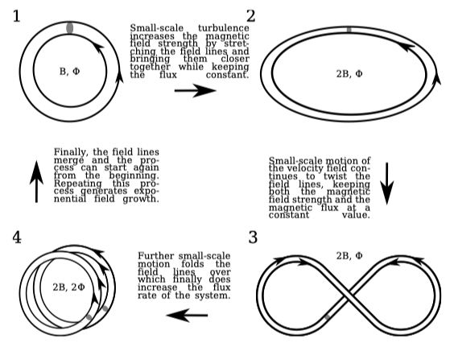
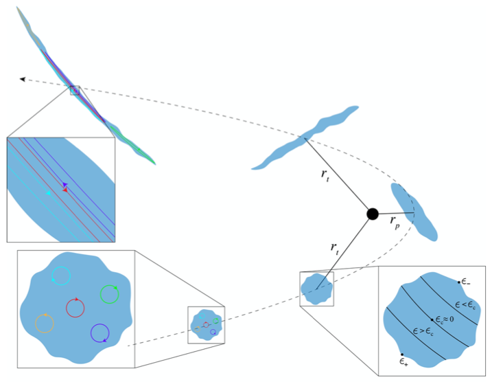
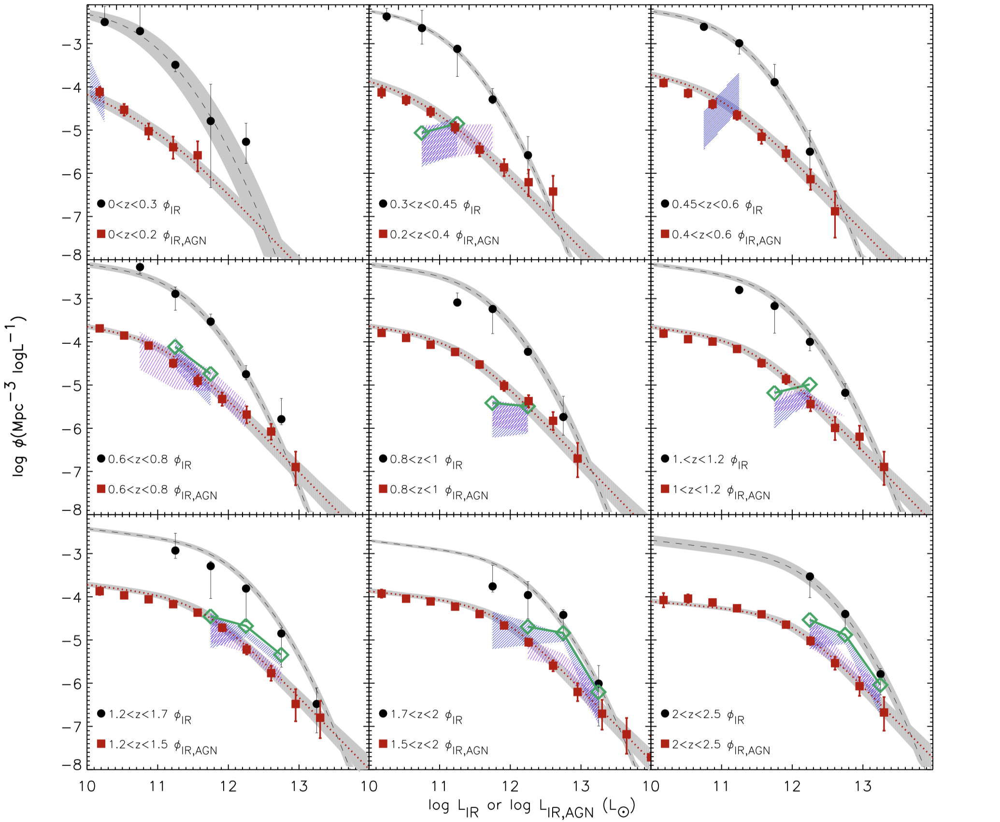
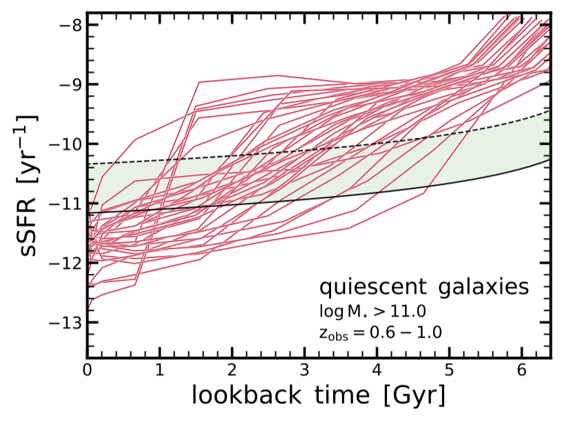
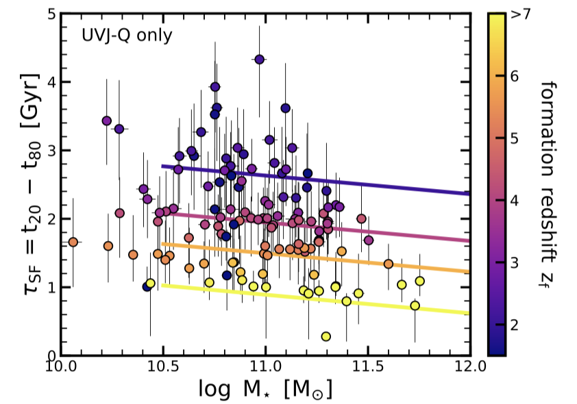

[toc]

# Astro-ph in 2021

## Driven galactic outflows with magnetic fields

Steinwandel et al. [arXiv:2012.12905](https://arxiv.org/abs/2012.12905)

Galactic outflows are ubiquitous in galaxies. They can be powered by stellar feedback or more energetic AGN feedback, but the exact way to lunch the outflows is still far from being understood. This work proposed a toy model to link the local magnetic with the outflow. To make magnetic strong enough to lead galactic outflows, the crutial question is what is the magnetic seed and how they can be amplified.

The ways to form the magnetic seed field including: mis-alignment of pressure and density gradients(Biermann-battery), Slow down of photons from Thompson scattering, supernovae (𝛼-Ω-dynamo), and plasma instability (Weibel-Instability). This work more concentrated on the amplication dynamo, which they called $𝛼^2$-Ω-dynamo, which featured that the small scale magnetic field can be amplified exponentially by small-scale turbulent. In a Milky Way like disk galaxy, the small scale magnetic field can be amplified by the formation of bar, then the strong magnetic field can launch galactic wind.

## Non-thermal filaments from the tidal destruction of clouds in Galactic center

Coughlin et al. [arXiv:2010.13790](https://arxiv.org/abs/2010.13790). [MNRAS](https://academic.oup.com/mnras/article/501/2/1868/6027702?rss=1)

Many non-thermal filaments were found in the Galactic center, with different length and different orientation. However, the longest ones were found to be perpendicular to the Galactic disk and their magnetic is highly ordered (10𝜇G to 1mG) and parallel to its axis. The formation of these kind of filaments has long been a puzzle, though several ways have been  proposed, like shock, stellar wind, outflow.

In this work, the authors have proposed one simple channel to form this magnetized filaments. The figure nicely summarrized their model. When the molecular clouds approach the SMBH (or central stellar cluster), the gravitational force will stretch the clouds in radical direction. At the same time, the closed magnetic field in the clouds will also be stretch along the same direction, and the following magnetic reconnection will make the ordered magnetic field parallel to the axis.

This is a theoretical paper, but the text and the sketch is quite easy to understand. Besides this small scale phenomena in Galactic center, the kinematics induced magnetic field could be also interesting in galactic interactions. If so, we may also expect to find the large scale ordered magnectic field in the tidal distrupted satellites. Beside, it may be important for high-energy physics, since the magnetic reconnection can play some roles here.

## AGN and star formation across cosmic time

M. Symeonidis and M. J. Page [arXive:2102.11936](https://arxiv.org/abs/2102.11936)

Infrare (IR) is essential to probe the on-going star formation activity in galaxies, especially the dust obscured galaxies. But besides star formation, AGN can also heat the dust and thus could potentially dominate the IR luminosity. So in order to better constrain the SFR, dust temperature from total IR luminosity, it is important to quantify the different contribution from star formation and AGN.

In this work, they discussed the contribution from AGN and star formation by their IR luminosity function across cosmic time. It is easier to get the total IR luminosity function, so one important step in this work is to get the pure AGN IR luminosity function independently. What the author did is get the pure AGN IR from hard X-ray sample. Firstly convert the X-ray luminosity to 5100$\AA$ luminosity, then derive total IR luminosity from AGN SED. They found (as shown in the figure) the pure AGN IR luminosity function will converge with the total IR luminosity function of star forming galaxies at high luminosity end. Where the authors interpreted as AGN dominate the IR. With AGN IR luminosity function, they also discussed the correction for SFR and dust temperature derived from total IR luminosity if we seperated the AGN out.

This is a quite straightforward paper and it actually comes out from a couple in UCL. From my understanding, the most critical step for this paper is the derivation of pure AGN luminosity function. Two things may need further discussion is the AGN completeness from hard X-ray sample and the systematic errors when converting X-ray luminosiy to IR luminosity. In short, it is good reference when interpreting the AGN fraction from the SED fitting.

## Fast, Slow, Early, Late: Quenching Massive Galaxies at z ~ 0.8

Sandro Tacchella et al. [arXiv: 2102.12494](https://arxiv.org/abs/2102.12494)

 It has been years that people are arguing the progenitors of massive ellipticals of our local Universe. One promising candidate is the distant, dusty star forming galaxies (also called submillimeter galaxies, SMGs), who have strong star formation activity and some of them are merging systems. From a rough calculation of SMGs, it they effiently convert all their gas reserviors into stars, they would reach the same stellar mass. But in real galaxies, the formation of massive elliptical galaxies could be much more complex. This work, starts from the quenched galaxies, trying to reproduce their SFH, which could provide insights about their evolution pathes.

To recoverge the SFH of the massive ellipticals, the authors mainly benifit from two things, the first one is the high quality spectra taken from Keck II/DEIMOS and the new non-parametric, Baysian based SFH fitting code *Prospector*. Fig-1 shows the SFHs of their sample. , some of them quench very rapidly while some maintain a stable SFR for a long time. They are quite different from each other, indicating the complex queching paths. On the other hand, they found one intesting pattern in Fig-2, which shows the early formed galaxies have a much shorter star-forming timescale. They also found rejuvenation and "later bloomers" are quite common and they are not exactly following the SFMS.

This is a very nice paper, which provides an independent way to contrain the progenitors of ellipticals. If we put SMGs into Fig-2. they should mosting gathered around the pink and yellow lines. However, we know SMG can use their molecular gas reservior around 0.1 Gyr (Bothwell+2013). That means we definitely needs quite amount of gas inflow to support the formation of their stellar mass.

---

---

**Start with new format: overview of week & the paper of the week**

---

---

## March

1. [McLeod et al. astro-ph: 2009.03176](https://arxiv.org/abs/2009.03176) Stellar mass function over the last twelve billion years 

2. Connection between the compact SMGs with local Ellipticals
3. Radio-loud AGN in the early Universe

## March

This week several papers focus on the AGN, the insteresting ones:

1. [Radcliffe et al.](http://arxiv.org/abs/2103.08575) **Nowhere to Hide: Radio-faint AGN in the GOODS-N field **The performance of difference AGN selecting methods on a sample of VLBI AGN sample: no single method can find all VLBI AGN; X-ray current are not sensitive for highly obscured AGN; a fraction of VLBI AGN in starburst system (another evidence for the AGN may play a role in SMGs)
2. [Efstathious et al.](https://arxiv.org/abs/2103.08032) Another SED confirmed AGN dominated starburst galaxy at z~4.3: Good example to show the importance of AGN for SMGs, but again SED may only sensitive to this kind of strong AGN. **They data analysis should be questioned**

[Andrea Ferrara & Celine Peroux](http://arxiv.org/abs/2103.06887) Analysed the three ways of dust destruction which aims to explain the dust decreasing from z=1->0, they conclude that dust destroyed by SN shocks have been overestimated before

[Anna Ferre-Mateu](https://arxiv.org/abs/2103.09241) Formation channel of low-mass elliptical galaxies: diver formation channel

## March

### AGN

1. [McKinney et al.](http://arxiv.org/abs/2103.12747) **DUST-ENSHROUDED AGN CAN DOMINATE HOST-GALAXY-SCALE COLD-DUST EMISSION** Discussed the cold dust emission powered by obscured AGN. The standard torus structure play a minor role in the far-infrared emission, but the diffused dust of the host galaxy can also be heated by radiative tranfer from the obscured AGN.  

## April

### Week-1

**SMG**

[Cochrane et al]() Multi-wavelength and High-res observation of one starburst galaxy at z~2.2. Two important points we can learn from this source:

1. Shortwavelength (UV and optical data) can be biased for infering the dusty galaxies' properties
2. Compact dust emission not means the galaxy is also compact

[Rybark et al.](http://arxiv.org/abs/2101.00841) Ultra faint [C II] in a metal-poor dwarf galaxy at z~2: Taking advantage of the strong lensing, the author try to search the [C II] and CO(2-1) in z~2 metal poor dwarf galaxy, [C II] shows a tentative detection while CO(2-1) remains undetected. This kind of galaxy can be important at EoR. But also maybe strong lensed source are not the ideal target for somehow extended [C II].

[Piyush Sharda](http://arxiv.org/abs/2007.02678) With improvement in resolution which is crutial to capture the dynamo of evolution of magnetic field, they found magnetic field effect is alway non-negligible for the formation of Pop-III star and could largely change the primodial IMG. **Turbulence amplification for primodial magnetic field is very efficient.****

[W. Bednarek & J. Sitarek](http://arxiv.org/abs/2102.11589) An instersting paper discussed the absorption of $\gamma$ ray when one luminous star across the beam of jet. They focus on the spectra of $\gamma$-ray, which will harden at the hundreds of Gev. **One naive question may be: what is their spectral feature at sub-mm and radio band? Can it be used to study the vicinity of SMBH and the stars?****

[Jisu Kang et al](http://arxiv.org/abs/2104.00672) Systematic globular cluster searching in 12 nearby massive compact elliptical galaxies, they found they have larger fraction of red globular fraction 0.5, which is larger than the fraction of 0.3 in giant elliptical galaxies. The more red globular cluster means most of the stellar mass formed or accreted in more early time. **Maybe another contrain for the evolution path from SMG to Ellipitcals**  

### Week-2

[Nianyi Chen](arXiv:2104.00021v2) Discussed the importance of Dymaic Friction on the SMBH. With dynamic friction, SMBH can be more easily sink to galactic center and will enhance the cosmological merger rate  

[F. Fragkoudi](F. Fragkoudi) They disscussed the Fast-rotating bars of different simulation in the ΛCDM cosmological paradigm. The dynamic fraction of Dark matter can slow down the rotaion of bars. While they found the major cosmological simulation (Eagle and Illustris) tend to prodduce slow rotating bars, but the zoom-in simulatio of Augriga sucessfully produced the fast rotating bars. The main difference of Augriga is that it implemented weaker feedback and allow higher effeciency to convert the gas into stars.

[Yuma Sugahara](arXiv:2104.02201v1) Try to put a bright Lyman-break galaxy into BPT diagram. This galaxy had already been detected in [CII]158um and [OIII]88um , so they try to detect the [N II]122um. Because it's non-dectection, so they can only put upper limits. From where I found another paper by Allison L. Strom+2017. An old paper, but quite intersting, who put z~2 star-forming galaxies into BPT diagram, and got a new tracking line.

### Week-3

Two paper discussed the AGN in metal poor dwarf galaxies:

- [Colin J. Burke](http://arxiv.org/abs/2011.10053) Detections of AGN-like variation on 3 metal-poor dwarf galaxies, possible the signature of ~100 Msun BH signature.

- [Cann Jenna](http://arxiv.org/abs/2104.05689) Detection of ${\rm Si}_{6}\ 1.963$ um coronal line in the metal-poor dwarf SDSS~J160135.95+311353.7

[S. Goswami](https://arxiv.org/abs/2104.05680) IMF's effect on the galactic chemical enrichment, they emphasized the importance of massive star (stars as massive as 350Msun) are essential to explain the chemical evolution of Galacitic thick disk.

## May

### Week-2

[Angela Collier](http://arxiv.org/abs/2105.04698) Discussed the coupling with stellar bar and the dark matter halo. The found the presence of strong stellar bar will also form a thick, parallel dark matter bar. It can be a place to search for dark matter annihilation signals.

[Kunihiko Tanaka](http://arxiv.org/abs/2105.04579) They discussed the [C I] in the central molecular zone and circumnuclear disk. It is a work followed by their previous finding that enhanced [C I] had been observed in the east of SgA complex. In this work, they complete a survey of [C I] covering almost all of the CMZ. They results show that [C I] comes from low-excitation gas with 20-50 K, while they were suppressed in high-excitation zone. Also a ring like [C I] is observed, mostly likely due to the SNR-cloud interaction

### Week-3

[Aditya Chowdhury](http://arxiv.org/abs/2105.06773) It is the second paper of the same group which stacking the GMRT archive data to search for HI 21cm emission  at hight redshift. Last time [Aditya Chowdhury](http://www.nature.com/articles/s41586-020-2794-7), they have push the detection to redshift around z~1. In this new paper, they stacked the data of star forming galaxies at z = 1.18 − 1.39, and also reached a 5sigma HI detection. Their result provide a new insight that the HI cannot sustain the star forming activity at z<1.

**AGN**

1. [M. Pereira-Santaella](arXiv:2104.08238v2) The sub-kpc view of the 220 GHz continuum. This work is based on PUMA project, which is a ALMA and MUSE survey of local ULIRGs. The main goal of this work is to search for AGN signatures in these local ULIRGs. Based on their 220GHz dust continue and CO(2-1), they have derived the molecular gas surface density; from SED fitting, their LIR can also be well constrained. They found their LIR cannot be explained by maximum starburst activity with reasonable gas deplete time, thus give an indirect evidence of the presence of strong AGN in these ULIRGs.

### Week-4

[Fensch 2021](arXiv:2011.12966v3) Followed the discussion of [Faure 2021](http://adsabs.harvard.edu/abs/2021MNRAS.502.4641F), Fensch et al. studied the existance of giant molecular cloud in high-z galaxies with different gas fraction. They mainly found higher gas fraction will lead to form large and long-lived molecular cloud, and the feedback has a secondary effect on the existance giant clumps.

Magnetic field:

1. [Borlaff et al.](arXiv:2105.09315v1) This work has systematically compared the magnetic field oritation at different wavelength (Far-IR 154um+3cm+6cm). They found the polarisation at different wavelength may not trace the same magnetic field structure.

[Leindert A Boogaard et al.][arXiv:2105.12489v1] This is a non-detection paper, but it quite important contrains for future deeper survey. The authors made used of the Lya galaxies in the Hubble Ultra Deep Field found by Muse HUDF survey. Then, their redshift were comfirmed from following-up spectral observations from MOSFIRE and KMOS which make it is possible to stacking their dust continuum and molecular lines with known accurate redshift. Howerver, they did not detect CO and CI and even dust continuum. These star-forming galaxies are found to be metal poor, indicating the difficulties to detect their melecular gas and dust. 

# Reviews

Dar matter and early Universe: a review [arXiv:2104.11488](https://arxiv.org/abs/2104.11488)

AGN reverberation mapping review: from X-ray corona to dusty torus [arXiv](https://arxiv.org/abs/2105.06926)

