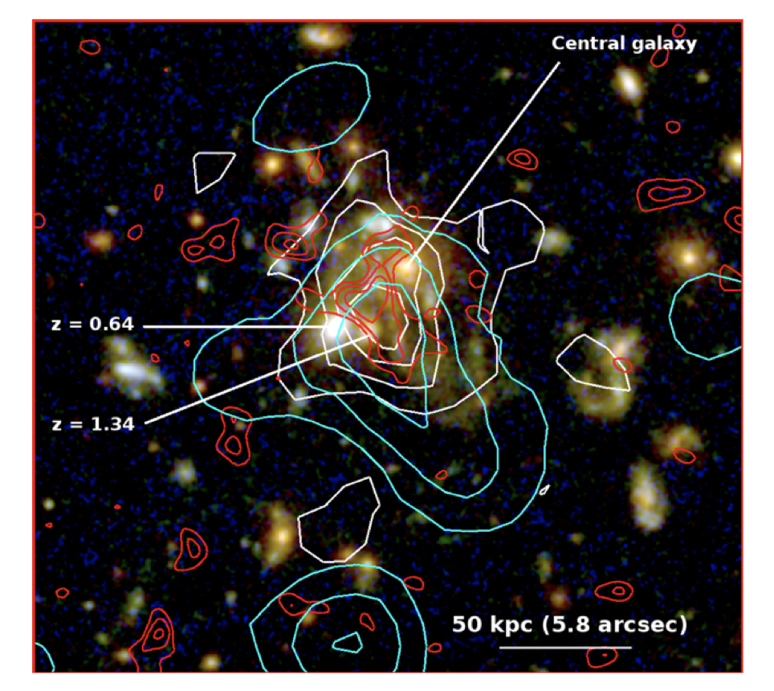

Question:

1. What fueled the central SMBH or Does the feedback of SMBH matters in the early stage of the cluster formation and fueling. 

 Based on soft-X observation, they found the hot X-ray gas from runaway cooling would play an important role to fuel the central starburst. The most striking point of the x-ray is the offset between x-ray center and the BCG, but the x-ray core align with the starburst core.

 

The false color image is the HST the composition of F160W, F150W and F814W filters.  cyan contour is the X-ray 0.7-1.0 keV emission. Red contour is the VLA CO (1-0) and white contour is the Spitzer MIPS 24 um emission. All the three component are offset from the baryonic center and the central galaxy with at least 25kpc.

Method to find the clusters and photo-clusters:

Ly𝛼 , the strongest line, both the emission and the absorption can be used. 

- Emission is called the Ly𝛼 emitter (LAE) 
- Absorption is the Lyman break galaxies (LBG) 

We can ask similar question that which methods we can used to do the number counts in the high redshift and what's their advantages and disadvantages:

- for SMG, their are mostly ULIRG in high-redshift, bright in the sub-mm band, with ALMACAL, we can even reach very deeply in portion of the sky

There maybe two story lines:

1. The discovery of (U)LIRG, traced by the IRAS --> Spizter --> Herchel
2. The discovery of of SMG, traced by the SCUBA --> ALMA

Jack E.  Birkin, Axel Weiss

Molecular line searching for 61 SMG

1. On and above the main sequence
2. Similar distribution on the M-sigma relation liking Coma cluster, their progenitor
3. Slow and fast rotator division at the 850um flux limit of 5mJy

In cosmological sense, ULIRG at low redshift only contribute a limit, however, it do matters in the higher redshift. The conterpart of ULIRG at higher redshift is SMG or DSFG. Selected by the flux density at 870𝜇m > 1mJy

As  a contrain to the cosmic star formation history, submm observation offers the best window to constrain the star formation density as the negative K-correction make the flux density of SMG nearly constant at large redshift coverage. Weiß+2013 

ALMA shortcut: cannot detect the peak the SED, thus can not break the degeneracy of the dust temperature and the ?**

Searching SMG:

1. Targeting the blank field
2. Target the cluster to utilized the lensed ones

The instruments used to study the number counts of SMG, in chronologically

- 
- SCUBA on JCMT and MAMBO on IRAM 30m

