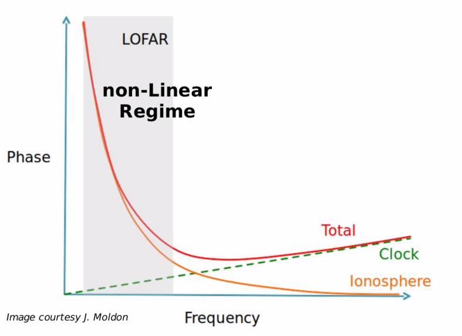

Dynamical range is a approximate of the fidelity of the finnal decolved image. Defined as the ratio between the highest peak of the image divided by the rms in the void.

# LOFAR Low frequency:

## Instrument effect

Polarisation alignment

clock offset

bandpass

ionosperic RM correction [EMextract]

Demixing: remove strong source from side-lobes 

LOFAR software

D

Beamforming:

---

$$\Delata \phi = $$

Long baseline interferometer:

- clock/delay correction

900 - 250 mas, 6'' - 0.3''

Fringe-fitting: process that estimate delays and rates

Baseline based fringe fitting

Challenge:

- Data volume
- Ionosphere
- 5deg FOV

LoTSS & H-ATLAS

