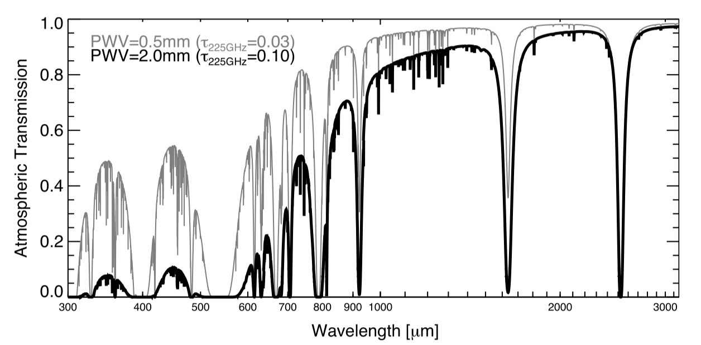
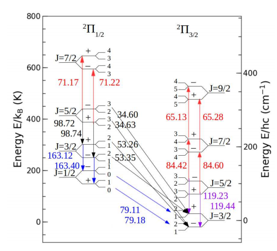
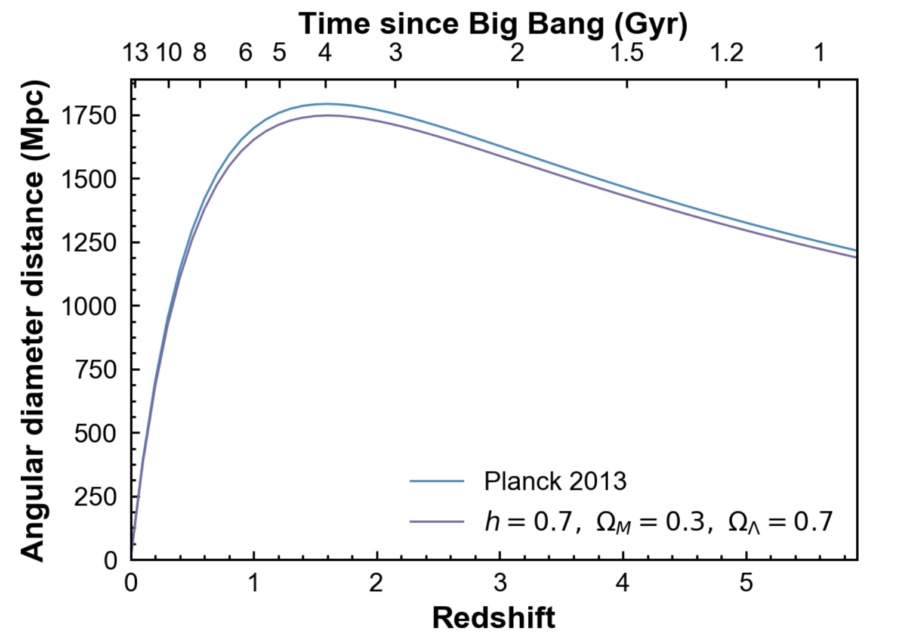
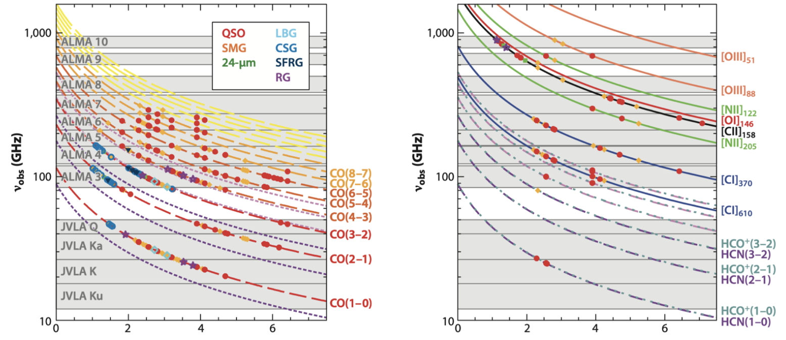

[toc]

# Constants

## Physical constants

  description          symbol      SI                                       cgs

-------------------- ----------- ---------------------------------------- ----------------------------------------------

  Speed of light       c           $$2.998 \times 10^{8}m\ s^{- 1}$$        $$2.998 \times 10^{10}\text{cm}\ s^{- 1}$$
  Mass of electron     $$m_{e}$$   $$9.11 \times 10^{- 31}\ \text{kg}$$     $$9.11 \times 10^{- 28}\ g$$
  electron             e           $$1.6 \times 10^{- 19}\ C$$              $$4.8 \times 10^{- 10}\ Fr$$
  Boltzmann constant   $$k_{B}$$   $$1.38 \times 10^{- 23}\ JK^{- 1}$$      $$1.38 \times 10^{- 16}\text{erg}\ K^{- 1}$$
  Plank constant       h           $$6.63 \times 10^{- 34}\text{erg}\ s$$   $$6.63 \times 10^{- 27}\text{erg}\ s$$

  Eddington Luminosity   $$1.3 \times 10^{38}\ \text{erg}/s$$

---------------------- --------------------------------------

## Solar Parameter

------------------------

  Mass                    $$2 \times 10^{33}g$$

----------------------- ------------------------------------------------------------------------------------------------------------

  Radius                  $7 \times 10^{10}\text{cm}(0.5{^\circ})$ photosphere*,* same as moon
  Distance                $1.5 \times 10^{15}\ \text{cm}$ (1A.U.)
  Bolometric luminosity   $$3.8 \times 10^{33}\text{erg}/s$$
  Age                     4.6Gyr
  Temperature             $5772K_{ph\text{otosp}h\text{er}}$ $5 \times 10^{6}K_{\text{corona}}$ $1.6 \times 10^{7}K_{\text{center}}$
  Density                 $$1.4g/cm^{3}$$
  Rotation Period         About a month
  X-ray luminosity        $0.4\sim 4 \times 10^{27}\text{erg}/s$ (solar min to solar max), $10^{28}erg/s$ for flares
  Earth reflect X-ray     $$10^{14}erg/s$$

 

## Milky way

Stellar BH        $$10^{8}\sim 10^{9}$$
Number of stars   $$2.5 \pm 1.5 \times 10^{11}$$
Mass              $$0.8\sim 1.5 \times 10^{12}\ M_{⦿}$$
Star density      About $1/pc^{3}$ (roughly get from solar\'s nearest neighbours

local universe

1 billion lyr \~ 300 Mpc \~ z=0.07

# Basic conversions

Conversion from ∆𝜆 to ∆v:

$\frac{\delta \lambda}{\lambda} = \frac{\delta v}{c} \to \frac{\rm 0.2\,nm}{\rm 500\,nm} = \frac{\rm 120\,km\,s^{-1}}{\rm 3\times 10^5\,km\,s^{-1}}$

Earth rotational speed: 0.465 km/s

Earth revolution speed: 29.29~30.29 km/s

1eV ～ 10^4^ K ～ 10^4^Å  

1pc = 3.26 lyr

Lyr = 63000 AU

1rad = 206265 arcsec => $206265 = \frac{180}{\pi}\times3600$

# Observation

The Infrared astronomy:

| Designation   | Abbreviation |        Wavelength        |
| :------------ | :----------: | :----------------------: |
| Near-Infrared |     NIR      |     (0.7–1) to 5 μm      |
| Mid-Infrared  |     MIR      |     5 to (25–40) μm      |
| Far-Infrared  |     FIR      | (25–40) to (200–350) μm. |

𝜆~max~ T = 3 mm * K

(sub)-millimeter windows:

350 µm (860 GHz)  450 µm (670 GHz)  770 µm (390 GHz)  870 µm (345 GHz)  1.2 mm (250 GHz) and 2 mm (150 GHz)

[Photometric system](https://en.wikipedia.org/wiki/Photometric_system)

|                                                              |                                                              |                                                              |                                     |                             |
| :----------------------------------------------------------: | :----------------------------------------------------------: | :----------------------------------------------------------: | :---------------------------------: | :-------------------------: |
|                        Filter Letter                         | Effective Wavelength Midpoint λeff for Standard Filter[[2\]](https://en.wikipedia.org/wiki/Photometric_system#cite_note-JamesBinney-2) | Full Width Half Maximum[[2\]](https://en.wikipedia.org/wiki/Photometric_system#cite_note-JamesBinney-2) (Bandwidth Δλ) |             Variant(s)              |         Description         |
|                         Ultraviolet                          |                                                              |                                                              |                                     |                             |
|                              U                               |                            365 nm                            |                            66 nm                             |              u, u', u*              | "U" stands for ultraviolet. |
|                           Visible                            |                                                              |                                                              |                                     |                             |
|                              B                               |                            445 nm                            |                            94 nm                             |                  b                  |    "B" stands for blue.     |
|                              V                               |                            551 nm                            |                            88 nm                             |                v, v'                |   "V" stands for visual.    |
| G[[3\]](https://en.wikipedia.org/wiki/Photometric_system#cite_note-Bessell2005-3) |                            464 nm                            |                            128 nm                            |                 g'                  |    "G" stands for green.    |
|                              R                               |                            658 nm                            |                            138 nm                            |        r, r', R', Rc, Re, Rj        |     "R" stands for red.     |
|                        Near-Infrared                         |                                                              |                                                              |                                     |                             |
|                              I                               |                            806 nm                            |                            149 nm                            |          i, i', Ic, Ie, Ij          |  "I" stands for infrared.   |
|                              Z                               | 900 nm[[4\]](https://en.wikipedia.org/wiki/Photometric_system#cite_note-4) |                                                              |                z, z'                |                             |
|                              Y                               |                           1020 nm                            |                            120 nm                            |                  y                  |                             |
|                              J                               |                           1220 nm                            |                            213 nm                            |               J', Js                |                             |
|                              H                               |                           1630 nm                            |                            307 nm                            |                                     |                             |
|                              K                               |                           2190 nm                            |                            390 nm                            | K Continuum, K', Ks, Klong, K8, nbK |                             |
|                              L                               |                           3450 nm                            |                            472 nm                            |              L', nbL'               |                             |
|                         Mid-Infrared                         |                                                              |                                                              |                                     |                             |
|                              M                               |                           4750 nm                            |                            460 nm                            |               M', nbM               |                             |
|                              N                               |                           10500 nm                           |                           2500 nm                            |                                     |                             |
|                              Q                               | 21000 nm[[5\]](https://en.wikipedia.org/wiki/Photometric_system#cite_note-Jursa-5) | 5800 nm[[5\]](https://en.wikipedia.org/wiki/Photometric_system#cite_note-Jursa-5) |                 Q'                  |                             |

ALMA [band information](https://www.eso.org/public/teles-instr/alma/receiver-bands/)

| **ALMA Band** | **Wavelength coverage (mm)** | **Noise Temperature (K) Specification** | **Frequency (GHz)** | **Produced by**                                              | **Receiver Technology** | **First light** |
| ------------- | ---------------------------- | --------------------------------------- | ------------------- | ------------------------------------------------------------ | ----------------------- | --------------- |
| 1             | 6–8.5                        | 26                                      | 35 – 50             | TBD                                                          | HEMT                    | TBD             |
| 2             | 3.3–4.5                      | 47                                      | 65 – 90             | TBD                                                          | HEMT                    | TBD             |
| 3             | 2.6–3.6                      | 60                                      | 84 – 116            | [HIA](http://astroherzberg.org/)                             | SIS                     | 2009            |
| 4             | 1.8–2.4                      | 82                                      | 125 – 163           | [NAOJ](http://www.nao.ac.jp/en/)                             | SIS                     | 2013            |
| 5             | 1.4–1.8                      | 105                                     | 163 – 211           | [OSO](http://www.chalmers.se/en/centres/oso/Pages/default.aspx) [/](http://www.chalmers.se/en/centres/oso/Pages/default.aspx) [NOVA](http://nova-astronomy.nl/) | SIS                     | 2016            |
| 6             | 1.1–1.4                      | 136                                     | 211 – 275           | [NRAO](https://public.nrao.edu/)                             | SIS                     | 2009            |
| 7             | 0.8–1.1                      | 219                                     | 275 – 373           | [IRAM](http://www.iram-institute.org/)                       | SIS                     | 2009            |
| 8             | 0.6–0.8                      | 292                                     | 385 – 500           | [NAOJ](http://www.nao.ac.jp/en/)                             | SIS                     | 2013            |
| 9             | 0.4–0.5                      | 261                                     | 602 – 720           | [NOVA](http://nova-astronomy.nl/)                            | SIS                     | 2011            |
| 10            | 0.3–0.4                      | 344                                     | 787 – 950           | [NAOJ](http://www.nao.ac.jp/en/)                             | SIS                     | 2012            |

850um --> 345GHz

CO J=1-0, 115.27 GHz

CO J=2-1, 230.54 GHz

CO J=3-2, 345.8 GHz

CO J=7-6, 806.65 GHz

[C II] 157.7um, 1900GHz

OH lines: From [Runco 2020](https://arxiv.org/pdf/2009.07293.pdf)

Resolution estimate:

100GHz

GHz —> mm

30 / 115 GHz = 0.26 mm

arcsec —> pc (for nearly galaxies)

100GHz, 10m, 50 kpc : 30 pc

100GHz/f * d/10 m * D/100 kpc —> 30dD/f pc

1arcsec, 1Mpc, —> 290pc

arcsec —> kpc (for high-z galaxies)

 

[ref](http://learn.astropy.org/edshift_plot.html)

Local Group: the Group contains the M31 (Andromeda) and Milky Way. It has a diameter about 3 Mpc. 

Local Volume: centered in the Local Group with a radius of 10 Mpc. Including several groups like: Sculptor Group, Centaurus A Group. Most of the group members have accurate distance measurements.

