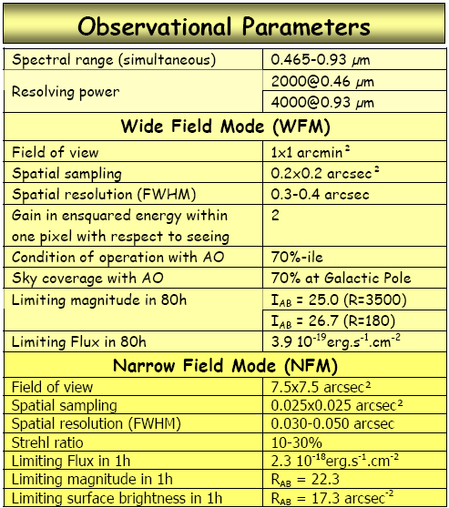

[Jy km/s or K km/s to flux pick](https://help.almascience.org/index.php?/Knowledgebase/Article/View/287)

[Estimate flux peak of different beam](https://help.almascience.org/index.php?/Knowledgebase/Article/View/286/1/)

Covert between signal dish and interferometer [this](https://help.almascience.org/index.php?/Knowledgebase/Article/View/286/1/)

[Conversion of source velocity/redshift to sky frequency](https://www.iram.fr/IRAMFR/ARN/may95/node4.html)

From relativistic velocity, the line of sight velocity described in rest frequency $\nu_0$ and observed frequency $\nu$ is:

$$V = \frac{\nu_0^2-\nu^2}{\nu_0^2+\nu^2}c$$

The difference of radio velocity and optical velocity

$v_{opt} = cz = c\frac{\lambda - \lambda_0}{\lambda_0} = c\frac{f - f_0}{f}$

Radio velocity used in low redshift (comes from frequency shift):

$v_{radio} = c\frac{f_0 - f}{f_0}$

As a result $v_{opt} \neq v_{radio}$

So the calculation from velocity to frequency is:

- Optical conversion (used for extra-galaxies)

  $f_{\rm sky} = f_0\frac{1}{1+z} = f_0\frac{1}{1+v_{\rm opt}/c}$

- Radio convention

  $f_{\rm sky} = f_0(1 - v_{\rm radio}/c)$

$f_0$ is the rest frequency

[VLA call for proposal]( https://science.nrao.edu/observing/call-for-proposals)

[VLA Plans and Proposal Deadline](https://science.nrao.edu/facilities/vla/proposing/configpropdeadlines)

IRAM & NOEMA: https://www.iram-institute.org/EN/content-page-169-7-57-169-0-0.html

MUSE: observational parameters

**Chandra parameters**:

| Parameters     |  value         |
| ------------------------ | ----------------------------- |
|  ***Field of View:***    |        1.0 degree diameter                        |
| ***Ang. Resolution:***   | 0.5 arcsec                    |
| ***Pointing Accuracy:*** | 30 arcsec 99% of viewing time |
| Wavelength | 0.12–12 [nm](https://en.wikipedia.org/wiki/Nanometre) (0.1–10 [keV](https://en.wikipedia.org/wiki/Kiloelectronvolt)) |

**GALEX**

Resolution 4.5-6 arcsec

## Sensitivity of radio telescope

The final sensitivity affected by several steps:

1. Weighting scheme, natural weight better than robust weighting

2. Confusion: 
   - Unresolved background source in the synthesized beam, mostly server in the low resolution observations.  
   - Confusion from the side-lobe of primary beam, also primarily affect the low frequency observations.

3. Weather
4. Signal sampling, VLA 3-bit sampler will introduce 10-15% additional loss

Reference:

1. [VLA sensitivity calculation](https://science.nrao.edu/facilities/vla/docs/manuals/oss/performance/sensitivity) 