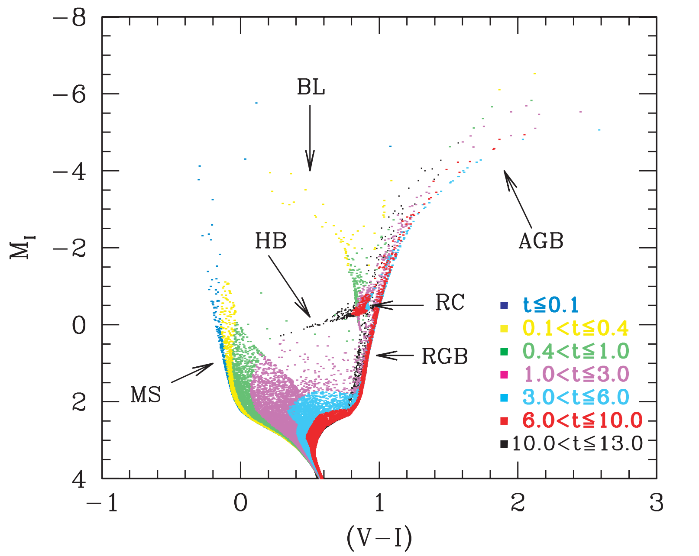
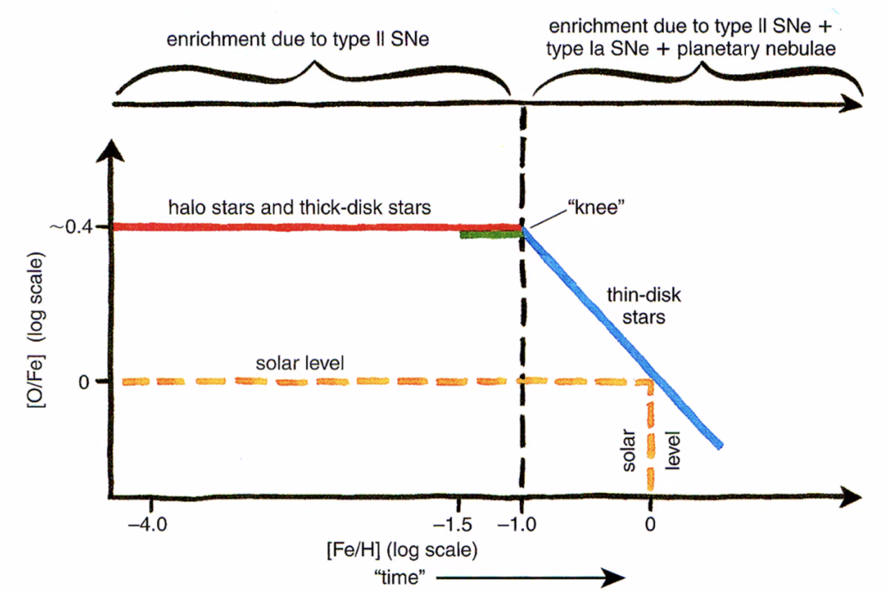

# Basic concepts

Effective temperature: The effective temperature of a star is the temperature of black body which have the same total luminosity as the star. The luminosity of star is come from the star surface, so the effective is also in term of star surface.

## Evolutional track

**Nova**:  produced by cataclysmic variable stars, that is a white dwarf accreting material (mostly are hydrogen) from its companion and the heating of white dwarf ignites the fusion of their hydrogen shell. Nova has many sub-types, fast nova (lasts less than 80 days) and slow nova and recurrent nova (if their accretion is stable). The hydrogen fusion (some times could be the helium fusion) controlled by the CNO cycle that can eject large amount of energy in a short time by the ejecta only takes up 1/10000 of solar mass. They are less energetic than supernova but more frequent (several tens per year in Milky Way).

**Kilonovae**: produced by the coalesce of two compact stars (neutron star + neutron star, neutron star + black hole). The energy of the burst comes from the heavy rapid neutron-capture process. It is supposed 1000 times brighter than nova but 1/10~1/100 of supernova. 

**Supernovae**: happened either by the accreting white dwarf or massive star. In the first case, the white dwarf ignite the run-away fusion by accrete matters from the massive star; another case is the core collapse of the massive stars.

SSP: single stellar population

SPS: Stellar Population Synthesis

SPS uncertainty:

- Rotation:
  - Rotation can bring fresh fuel to the central convective core to increase the MS lifetime
  - Lower the surface gravity and the opacity of the raditive envelope

- Binary:
  - mass transfer from the common envelope effects the spectra, especially the uv spectra, BPASS (Eldridge & Stanway 2009, 2012) 

### Pop III population

Pop III stars are supposed to form in mini halo (10^5^ ~ 10^6^ Msun) during z~20-50

Rapid neutron-capture process: capture the free neutron to produce heavy element (heavier than iron) in a fast way.

### Stellar Mentallicity

### Stellar Age

- White dwarf mass distribution
- Nucloe-chronometry
- Asteroseimology
- Isochrone fitting

## Dsitance Layder

TPGB: Tip of the red giant branch

- Advantage: Brigher than RR Lyrae, and less extinction than Cepheids

- Disadvantage: need fits the stellar evolution tracks, Age-mentallicity degeneracy
- Needs correction:
  - metallicity correction
  - bolometric correction

Red clump stars:

eclipsing binary: Detached eclips- ing binaries offer a simpler and less model dependent ge- ometry, and binaries containing late-type stars have the advantage in that accurate empirical surface brightness - color relations can be used to derive distances with an accuracy of 2%

Beyond local group:

Planetary nebula luminosity function (PNLF)

 Glabular cluster luminsosity function (GCLF)

Sueface brightness fluctuation (SBF)

Supernovae Ia

## Variable Stars

**Classical Cepheids**: Central He-burning, 

- Young, 10-200 Myr
- Period: 1-100 days

**Type-II cepheids**

- post-AGB. H-shell burning
- Period: 1-80 days

**RR Lyrae**, radial pulsator:

- Central He-burning
- Old, \>10 Gyr
- Period 0.2<0<1 day

**Mira**: 

- first discovered variable stars
- Long-period variables
- AGB stars

## Resolved stellar population:

### Chemical evolution: 

- old main sequence turn-off

- AGB and Planetary Nebula main contributor: C, N ,Na, Al and s-process
- Calcium triplet

- Type II SN,  𝛼 elements

- Type Ia, more Fe than 𝛼 elements

### star formation history

- different variable stars has different ages
- 1

Initial - Final mass relation: 

[O/Fe] - [Fe/H] relation 

Chiappini et. al (2001)

The synthetic CMD:

The 

𝜒^2^ minimization assuming Gaussian error distribution, it should be used with cautious if the error does not follow Gaussian distribution

- Milles libarary has a bad coverage of the metal poor stars