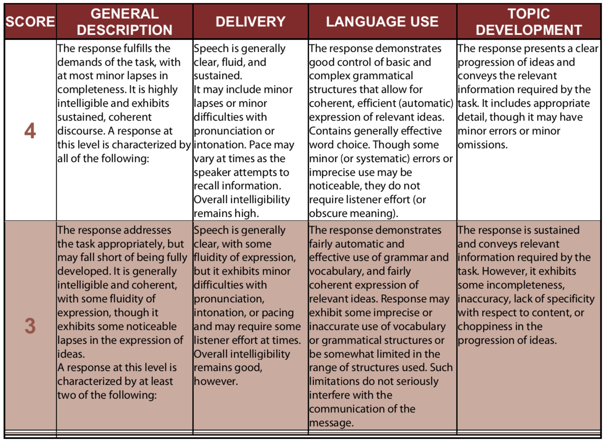
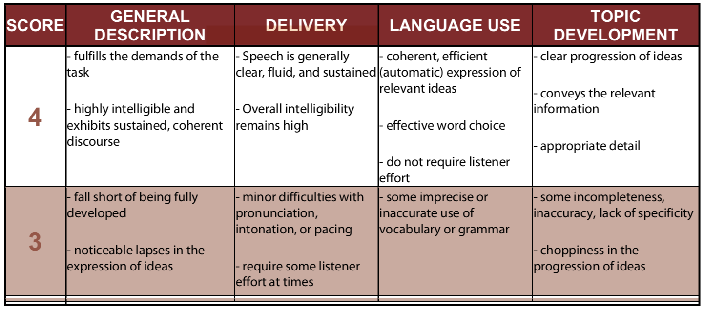

# Prepare TOEFL

## New TOFEL

| Test Section | Before August 1, 2019                                        | After August 1, 2019                                         |      |
| ------------ | ------------------------------------------------------------ | ------------------------------------------------------------ | ---- |
| Reading      | 3-4 reading passages 12-14 questions each 60-80 minutes | 3-4 reading passages 10 questions each 54-72 minutes |      |
| Listening    | 4-6 lectures, 6 questions each 2-3 conversations, 5 questions each 60-90 minutes | 3-4 lectures, 6 questions each 2-3 conversations, 5 questions each 41-57 minutes |      |
| Speaking     | 6 tasks - 2 independent - 4 integrated 20 minutes 1,2,3,4,5,6 | 4 tasks - 1 independent - 3 integrated 17 minutes 2,3,4,6 |      |
| Writting     | --                                                           | Longer questions                                             |      |

**speaking**: More words in the question title	

**writing**: No memorized examples

### Reading Types

1. **Vocabulary**, guess and move on
2. **Detail**, who, why how, location the detail sentence, the wrong answer: away, mixed, added, opposite
3. **Inference**, same as detail but make a jump from that
4. **Pronoun**
5. **Plugging** , find key word, it should after that, pronouns, links
6. **Paraphrase** , break down the sentence into piecese, check peice by peice
7. **Summary** , topic sentence, first sentence of the paragraphs, wrong are detail or opposite
8. **Purpose** , usually ask why, read the sentence before

### Speaking Evaluation:

Lecture:

1. show prove, add new words, example -> definish

2. understand first, note second

| What to explain | How to explain it | Timing |
| --------------- | ----------------- | ------ |
|                 |                   |        |
|                 |                   |        |

