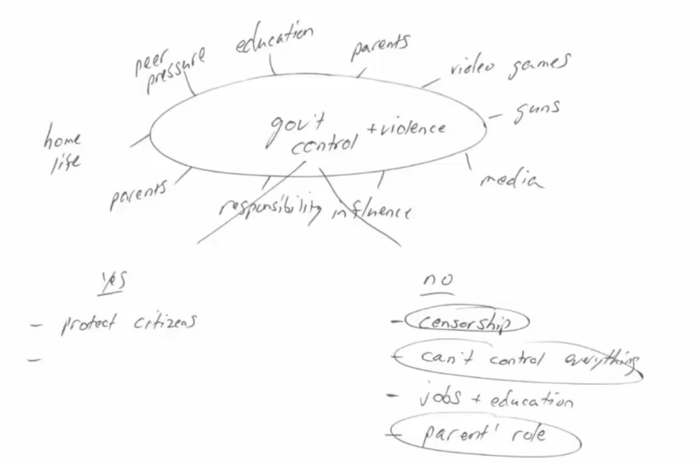

# Write to the top

## Integrated writting

### Strategy

The article states that/explores/provides/illustrates/presents..., However/But the lecture chanllenges what stated in the passage by providing...

To begin with, the reading claims/assert/contends that ... , the professor disagree with this point, which questions the point that...

On top of that, the article posits that ... . On the contrary, the professor/ the listening holds an opposite view that...

Lastly, in the reading, the auther contends that ..., the professor opposes/rebut reading's point that by explaining/stating 

**Paraphrase is import, no repeating. Not too much information from the reading**

### Possible expressions

**Object**

rebut/challenge/contradict with/is inconsistent with/refute/in contrast to/differ from/disagree with/questions the point/cast doubt on/disprove

1. This challenges the point in the reading that...
2. This contradicts with the literature that...
3. This is inconsistent with...
4. which refutes the points in the passage that...
5. which in contrast to...
6. differing from the statement that..
7. disagree with...
8. which questioned the point that

**Support**

1. Proof/reinforce/support/strengthen/endorse

 

Other useful:

| cogent/persuasive example | contribute              | benefit             |
| ------------------------- | ----------------------- | ------------------- |
| condemn                   | controversy             | necessary           |
| find inspiration in       | dilemma                 | trade-off           |
| entertainment             | personal stand          | merits and demerits |
| pros and cons             | strengths and weekness  | influence           |
| cram                      | count/take into account | be bound to         |
| as a conclusion           |                         |                     |

### Evaluation

1. Connection between reading and lecture
2. Clearly list all the main points
3. Using examples and explaination to expand the main points
4. Words and grammer are coherent

 

## Task2

Structure:

1. Introduction, restate the question, compare the two points and express the main thesis
2. Body, sub-points and examples or explanation
3. Conclusion, summarize, restate thesis, make recommendation

General writing

1. Not choose too big sub-topic, try to make smaller ones, it will be easier to expand and make examples. 

Paragraph

1. started with indent or new line
2. key thesis / central statement, with all the following to support the idea
3. details
4. 1. why important
   2. reasons
   3. examples
5. flow bridge, links connecting sentense, keep one topic
6. key terms as many as needed, but avoid repetition like (besides, in addition)
7. end with a bridge to another paragraph

> Great changes require a powerful hand to guide them and push them forward. Goverments have the power and influence of the law to support them. Moreover, they have access to means with which to enfore the law and punish offerderss. Individuals and corporations that pollute our air and waters will not stop doing so as long as they can profile from this action and do not fear consequences. A steel producer, for instance, will not cease dumping waste in a nearby river if it does not affect its bottom line. Taxing this company, on the other hand, might make it change its way of doing business. Yet, it is this very question of costs that limits anyone but the goverment to act  against pollution.

## Example 2-1

Introduction:

- What is the topic?
- What is the question/debate?
- What is my opinion?
- Why?

*Many people believe that the increased presence of violence in films and television these days is responsible for the rising incidents of violent crimes among youths in society. They argue that governments have a duty to control the media so as to reduce this phenomenon.*

Do you agree with this argument?


mind storm

Youth violence is a problem that many people blame on the media, which they believe should be supervised by the government. I disagree with this idea and believe instead that society itself should fix this problem.

In today's world, young people are influenced by many things, like television, films and websites. It is thus unreasonable to accuse only movies for increasing violence. In other words, today's youth come across all human behaviours equally, such as violence and kindness and greed and generosity. They can witness these things in one news broadcast just as much as they can in an action movie. Thus, blaming the entertainment industry is not only unfair, it is also wrong because it ignores the root causes of these behaviours. To suggest that governments should control this, then, is to avoid taking responsibility for ourselves.

Indeed, a government should not act as parents to its citizens. It exists to ensure a society can thrive, not to tell people what to do. On the other hand, parents can and must control what their children see online, in movies, or any other source. Consequently, parents must decide whether they want their children to watch a horror movie; it is not a government's job to ban a studio from making it. Once a government controls one sphere, it will be free to act in all areas of our lives because negative influences are everywhere and have always been so. Not only will government actions not stop violence, they will likely increase it as people fight for their freedoms. 

In conclusion, violence can be triggered by many things, including, but not limited to media influence. Governments should therefore not be allowed to restrict what entertainment companies produce because they will then have to spread their control to all areas of society.


Mistakes

1. Trying too hard: big words, idioms, long complicated sentences
   simple is best

   a double-edged sword, should explain the positive and negative aspect

   > The CEO's tenure at the company was abbreviated due to his reluctance to integrate  more females into upper managerial posts, thereby drawing the ire of the Board who consequently relieved him of his duties.
   >
   > The CEO's time was cut short because he would't promote women to the top of the positions, which angered the Board who then fired him.
   
2. No topic sentence. One paragraph, one central topic

3. Too many idea. No connection, no transitions

4. Good points but no examples, especially concrete example

5. I think x 1,2,3, just I think/agree/like/in my opinion/

6. Pet peeve: anoiy 

