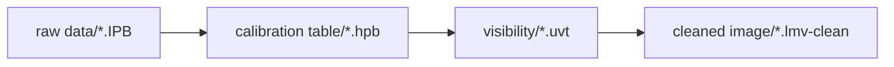
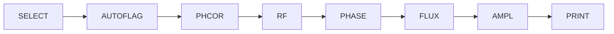
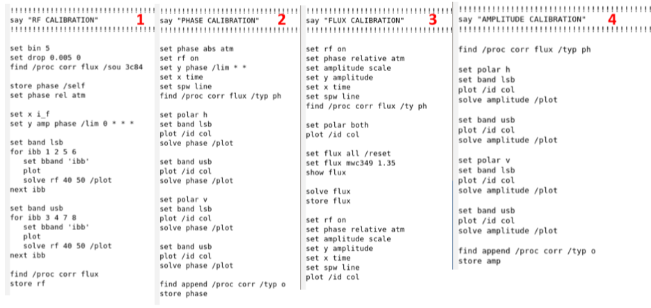
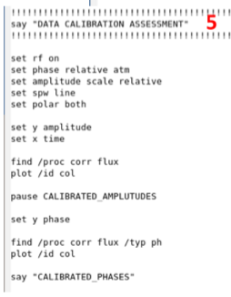

# NOEMA Calibration

[toc]


## Pipeline



Pipeline reports:

- Observing conditions: observational conditions, possible problems
- Data calibration: displays calibration solutions, bandpass + phase + flux + amplitude calibration
- Visibility assessment: data quality and suggested flagging


## Calibration steps

### The flow chart

Step1: check AoD notes, run pipeline, check pipeline reports

Step2: Introduce correction according to AoD and L.C. advice

Step3: Recalibrate with widgets, creating tables

Step4: Only for several tracks, check flux consistency between tracks


### Pipeline reports

1. Data calibration

2. Checking Observing Conditions

   produced by pipeline, including: Tracking, pointing, antenna, receiver, and instrument amp  error and phase drift

3. Visibility Assessment

   check amp and phase  in the uv plane

   - flagging criteria on the first page

   If several tracks: check the flux-calibration consistency 


### Widgets: data calibrationcd 




first to remove all the Data Quality Assessment flags by using the following commands:

```
file both ‘file name.hpb’
find
store flag redu /ant all /reset 
store flag redu /base all /reset
```


## CLIC commands

`help`, `file`, `find`, `list`, `plot`, `set x` and `set y`, `solve`


visualize data

```
set x amplitude
set y time
plot
```

Store calibration solutions

```
store phase
```

search calibration solutions

```
set y phase
set x time
solve phase /plot
```

visualize applied calibration

```
set phase relative
plot
```






### clic

```shell
@ pipeline s20bb001

@ pipeline s20bb002 14-jun

@ pipeline s20bb002 27-sep
```


load and copy the data

```shell
file raw s20bb002 27-sep
find
lis
set skip YES

file out 14-jun-2020-s20bb002.hpb new
copy header
file both 14-jun-2020-s20bb002.hpb
find
$ls
@15-jun-2020-base.clic
@ pipeline s20bb002 14-jun


```


flag data

```shell
find /scan channal_begain channel_end
store quality 9 # delete the selected data
find
lis
```


## Mappings

General command:

```
help command

let name uvtable_name

input command
go command
```

Plot:

```
let name <filename>
let first 80
let last 91
let ytype real
let xtype radius
go uvshow

inpu uvshow # to see the parameters
```


clean

```shell
# first rapid image
let map_size 64 64
let map_cell 1
go uvmap
go clean

# for the continuum
read uv <filename>
uv_cont
write uv <cont_filename>
go uvmap
go clean
```


