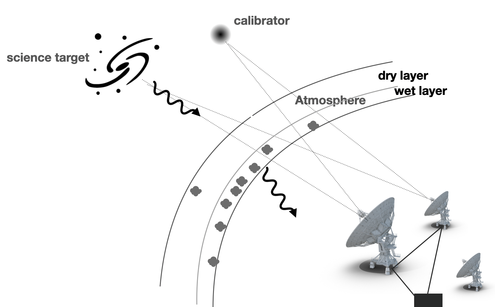

[toc]

# Calibration Notes

### What to be calibrated



**The external variations**: 
	They mainly come from our atmosphere. The atmosphere can be roughly treated as two components, the dry component and the wet component. Both the two components contribute to the refractive and absorption, but they have different time scale. The dry component, which is relatively low in water vapor, is stable and is chaninge slowly; while the wet component contains lots of water vapor, their high turbulence make the light path change very fast.
	Besides, for VLBI observation, the deformation of earth (caused by tidal force) should also be considered.

**The internal variations**: 
		It includes the antenna based effects, like the deformation, tracking errors and reciever reponse. Another error comes from the antenna digital system. It needs to compensate the geometric time delay and the delay variation caused by the cables.


### Calibration methods:

1. Direct calibrations

   The calibrations applied before observation (initial calibration) and on the fly during the obervation (routine corrections). The initial calibration includes pointing calibration, delay calibration, antenna position, time tracking, amplitude check, water vaper, and tiltmeters

2. Calibrators in the sky

   1. bandpass calibration
   2. gain calibration (phase calibration + amplitude calibration)
   3. flux calibration

3. Self-calibration


## Before calibration

Before the calibration, one firstly needs to check the [operator's log](http://www.vla.nrao.edu/cgi-bin/oplogs.cgi). It would remind you the performance of antennas, whether conditions and whether antenna positions need to be updated.

Firstly, check your raw data by printing all the relevant information:

```python
msfile = '*.ms'
listobs(vis=msfile, listfile=msfile+'.listobs.txt')
```

One can also give an overview by checking several plot beforehand

```python
# Checking antenna position, choosing the reference antenna
plotants(vis=msfile)

# Checking the evevation, determine the need of elivation calibration
plotms(vis=msfile, xaxis='time', yaxis='elevation', avgchannel='1e6', coloraxis='field')

# checking the valid timerange of data
plotms(vis=msfile, xaxis='time', yaxis='amplitude', avgchannel='1e6', coloraxis='field')

# checking the the valid channels
plotms(vis=msfile, xaxis='channel', yaxis='amplitude', avgtime='1e6', coloraxis='field')
```

> All those plots can be accessed more easily by `check_info` in plot_utils:
>
> ```python
> from plot_utils import check_info
> check_info(vis=msfile, spw='')
> # if you also want to give a glance for the calibrators and science target:
> check_info(vis=msfile, spw='', bcal_field='bcal', gcal_field='gcal', target_field='fcal',
>      refant='1') # set the `antenna` if you want cleaner plots
> ```


## Prior Calibrations

The prior calibrations mainly focus on antenna based calibration and some specialized calibration. 

CASA relies on `gencal` to generate calibration tables that can be used in `applycal` , `gaincal`, `bandpass` 


For low-frequency interferometer, the prior calibration usually contains:

1. **'antenna position':  Correction for antenna position. It will automatically fetch antenna position updates from online database. **

   ```python
   gencal(vis='vis', caltable='antpos.cal', caltype='antpos', antenna='')
   ```

2. 'gain curve': the solution of antenna efficiency as a function of elevation, for each receiver band. It comes from the deformation of the antenna structure and surface. It is not a critical steps, but becomes more important in high frequency, near the upper frequency limit of antenna.

   ```python
   gencal(vis='vis', caltable='gaincurve.cal', caltype='gceff')
   ```

   the parameter `caltype='gceff'` means gaincurve and antenna efficiency.

3. 'Opacity': atmospheric optical depth corrections, important for high frequency (>15GHz e.g., Ku, K, Ka, & Q band). 

   ```python
   myTau = plotweather(vis=msfile, doPlot=True) #it will generate the weather plot
   gencal(vis=msfile, caltable='opacity.cal', caltype='opac', parameter=myTau)
   ```

4. 'Ionosphere': correction for the polarization changes caused by the ionosphere, important for low-frequency (P, S, L-band)

5. 'Requantizer': optimizes the digital power within each spectral window, used for VLA 3-bit data or p-band 8-bit data 

   ```python
   gencal(vis='vis', caltable='requant.cal', caltype='rq')
   ```


## Bandpass Calibration

The bandpass calibration is used to correct the amplitude and phase response of different channels. Before running the actual `bandpass`, it is suggested to correct the time variation firstly.

To give an overview about how quickly phase changes with time (To speed up the plot, try to check the baselines related with the reference antenna):

```python
# phase change with time
plotms(vis='vis',field='bcal',xaxis='time',yaxis='phase', iteraxis='baseline',
       avgchannel='1e8',spw='0',antenna='refant', coloraxis='corr')
```

Give an overview about the phase changes with channel

```python
# phase change with channel
plotms(vis='vis',field='bcal', xaxis='channel',yaxis='phase',iteraxis='baseline',
       avgtime='1e8',spw='0',antenna='refant', coloraxis='corr')
```

If the phase changes significantly with channel, it is better to adapt a smaller range of spw to avoid delay-based closure errors when deriving the phase vs time solution for bandpass calibrator. If the phase vs channel is not flat in general, we may need the delay calibration.

> Same task can be done with `check_info` in plot_utils:
>
> ```python
> check_info(vis=msfile, bcal='bcal', antenna='refant', spw='')
> ```


 **Delay calibration** (optional): It comes from residual delay after goemetrial delay correction. This kind of delay is the linear slope of phase across frequency. The phase should be corrected until the phase slope across frequency is zero. For polarization calibration, one more delay calibration can be applied is the delay between two polarizations. 

```python
gaincal(vis='vis', caltable='delays.cal', field='bcal', 
        refant='refant', gaintype='K', 
        gaintable=['antpos.cal','gaincurve.cal','opacity.cal']) # all the caltable generated befor
```


Solve the phase variation along with time for the bandpass calibrator:

```python
gaincal(vis='vis', caltable='bpphase.gcal',
        field='bcal', spw='0:1000~1200',
        refant='refant', calmode='p', solint='int', minsnr=2.0,
        gaintable=['antpos.cal','gaincurve.cal','opacity.cal','delays.cal'])
```

Pay attention to the output of gaincal, one may need to increase the averaging channels `spw` or integrating time `solint` to increase the SNR.  

Inspecting the solution:

```python
plotms(vis='bpphase.gcal', gridrows=3, gridcols=3, xaxis='time', yaxis='phase',
       iteraxis='antenna', coloraxis='corr', plotrange=[0,0,-180,180])
```


Deriving bandpass calibration:

```python
bandpass(vis='vis', caltable='bandpass.bcal', field='bcal',
        refant='refant', solint='inf', solnorm=True,
        gaintable=['antpos.cal','gaincurve.cal','opacity.cal','delays.cal','bpphase.gcal'])
```

Please remember the `combine='scan'` is the default, if there are more than one scan for bandpass calibrator, `combine=''` to derive the solution independently.

Checking the bandpass results:

```python
plotms(vis='bandpass.bcal', gridrows=3, gridcols=3, xaxis='chan',
       yaxis='amp',iteraxis='antenna',coloraxis='corr')

plotms(vis='bandpass.bcal', gridrows=3, gridcols=3, xaxis='chan',
       yaxis='phase', iteraxis='antenna', coloraxis='corr')
```

> The solution of bandpass can be checked by the output of `check_bandpass` in plot_utils:
>
> ```python
> check_bandpass(fgcal='bpphase.gcal', fbcal='bandpass.bcal') # the two parameters is the default
> ```


## Gain Calibration

For the gain-calibrator, it is mainly used to correct the long-time phase and amplitude variation of the science targets. So, during the observation, we need to observe the gain calibrator occasionaly when we are observing our science target. Due to this, we may need a nearby and a bright gain calibrator to get a better calibration. 


Before we derive the long-time variation of the gain of the calibrator, we firstly need to correct their short-time variation if possible: 

```python
gaincal(vis='vis',caltable='phase_int.gcal',field='allcal',
        spw='0~1:4~60',solint='int',refant='refant',minsnr=2.0,calmode='p',
        gaintable=['antpos.cal','gaincurve.cal','opacity.cal','delays.cal','bandpass.bcal'])
```

Checking the results:

```python
plotms(vis='phase_int.gcal',gridrows=3,gridcols=3,xaxis='time',yaxis='phase',
       iteraxis='antenna',coloraxis='corr',plotrange=[0,0,-180,180])
```


Then, the long time variation can be derived by set the `solint='inf'`.

```python
gaincal(vis='vis',caltable='phase_scan.gcal',field='allcal',
        spw='0~1:4~60',solint='inf',refant='refant',minsnr=2.0,calmode='p',
        gaintable=['antpos.cal','gaincurve.cal','opacity.cal','delays.cal','bandpass.bcal'])

#Checking the results
plotms(vis='phase_scan.gcal',gridrows=3,gridcols=3,xaxis='time',yaxis='phase',
       iteraxis='antenna',coloraxis='corr',plotrange=[0,0,-180,180])
```


Apply the phase-only calibration of integrated time on the fly to derive amplitude solutions. (Calling gaincal by include the previous calibration table through `gaintable` will apply them first to get the new gaintable)

```python
gaincal(vis='vis',caltable='amp.gcal',field='allcal',
        spw='0~1:4~60',solint='inf',refant='refant',minsnr=2.0,calmode='ap',
        gaintable=['antpos.cal','gaincurve.cal','opacity.cal','delays.cal',
                   'bandpass.bcal','phase_int.gcal'])
```

This phase variation in `amp.cal` should be small (the residual after `solint='int'`phase gain calibration)

```python
# the scatter should be very small in phase
plotms(vis='amp.gcal',gridrows=3,gridcols=3,xaxis='time',yaxis='phase',
       iteraxis='antenna',coloraxis='corr',plotrange=[-1,-1,-20,20])
# 
plotms(vis='amp.gcal',gridrows=3,gridcols=3,xaxis='time',yaxis='amp',
       iteraxis='antenna',coloraxis='corr',plotrange=[-1,-1,0,5])
```


'Flux density': calculates the absolute flux density as a function of frequency and time based on flux calibrator

```python
# list all the avaible model
setjy(vis=msfile ,listmodels=True)
setjy(vis='vis', field='fcal') #, spw='', model='3C286_L.im')
```

Fluxscale, from flux calibrator to other sources: 

```python
fluxscale(vis='vis',caltable='amp.gcal',
          fluxtable='flux.cal',reference='fcal',incremental=True)
```

# 

Apply all the calibration:

```python
# for all the calibrator
for f in [bcal, gcal, fcal]:
	applycal(vis='vis',field=f,
        	gaintable=['antpos.cal','gaincurve.cal','opacity.cal','delays.cal',
                       'bandpass.bcal','intphase.gcal','amp.gcal','flux.cal'],
        	gainfield=['', '', '', bcal, bcal, f, f, f],
        	calwt=False)
```


For the science target:

```python
applycal(vis='vis',field='3',
        gaintable=['antpos.cal','gaincurve.cal','opacity.cal','delays.cal',
                   'bandpass.bcal','scanphase.gcal','amp.gcal','flux.cal'],
        gainfield=['','','',bcal, bcal, gcal, gcal, gcal],
        calwt=False)
```

Inspecting the corrected data

```python
plotms(vis='vis', xaxis='time',yaxis='amp',ydatacolumn='corrected',
       field=target, spw='0:4~60', correlation='RR,LL',
       avgchannel='64', coloraxis='antenna1')
```

> All the gain calibration solution can be checked by `check_gain` in plot_utils
>
> ```python
> # the default parameters follows
> check_gain(phase_int='phase_int.gcal', phase_scan='phase_scan.gcal', amp_scan='amp_scan.gcal')
> ```
>
> After apply the calibration, all the correct results can be visualized by `check_cal`:
>
> ```python
> # check the amplitude and phase of calibrator change with time and frequency:
> # set refant to plot with baseline, which is much faster
> check_cal(vis=msfile, spw='', cal_fields='0,1', refant='ea01') 
> # for the science target:
> check_cal(vis=msfile, spw='', target_field='2')
> ```

