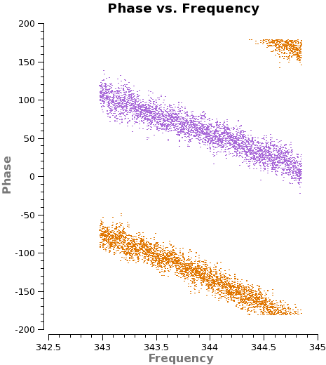
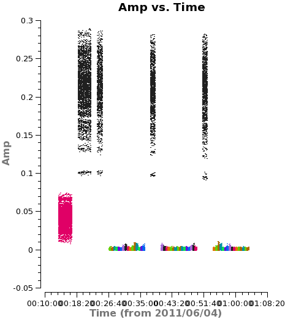
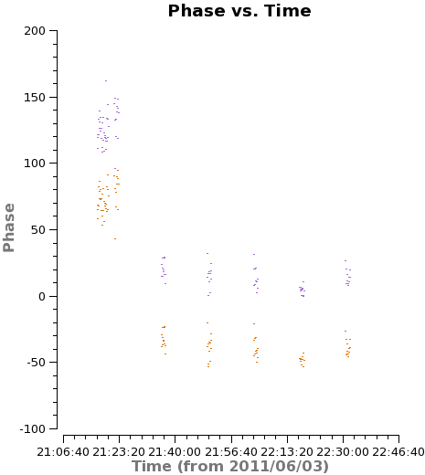
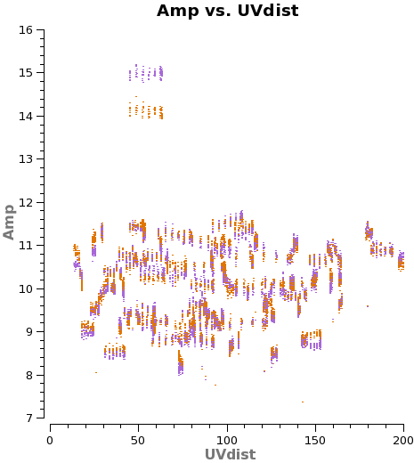

[toc]


## Calibration


**FDM**: frequency dominated mode, used for spectral line observation. In real data, the channel may be automatically Hanning smoothed, which means the true velocity resolution is little larger than proposed channel width.

**TDM**: time dominated mode, mainly for continuum,


calibrator:

- Flux calibrator

- Bandpass calibrator: correct the frequency response of the antennas

- Phase calibrator / gain calibrator: phase and amplitude response of the baseline over time. (close or a nearby point source)

  

spectral windows:

​	spw0: ~185GHz, holds water vapor raidiometer data

​	FDM: frequency-averaged data, science data,  lower and upper sideband

​	TDM: used to generate the calibration tables


## Steps of Calibration

1. Convert asdm into measureset

2. Fix known problems, like syscal and coordinate of planets
3. Priori flagging, the shadowed data, autocorrelation data and useless intent data 
4. Tsys, WVR, Antenna Position correction
5. Calibrate the amplitude and phase vs. frequency of each antenna, bandpass calibration
6. Calibrate the amplitude and phase vs. time of each antenna, phase and amplitude calibration
7. Set the absolute amplitude scale with reference to a known source
8. Apply all corrections to produce calibrated data


## Priori Flagging:

`flagdata`

1. mode: 
   1. unflag: reset the flagging
   2. shadow: flag the shadowed data
   3. manual: manually flag the data by
      - intent: scanIntent
      - field, 
      - antenna, 
      - uvdistance,
      - spw, 
      - timerange, 
      - correlation
   4. autocorr: flag autocorrelation data
2. flagbackup: back up the flag files

reset the flagging setted before

```python
flagdata(vis='', mode='unflag', flagbackup=False)
```


- shadowed data: antenna blocks the lines with another

  ```python
  flagdata(vis='', mode='shadow', flagbackup=False)
  ```

- carry out pointing and atmospheric calibration (through the scan intent)

  ```python 
  flagdata(vis='', mode='manual', intent='*POINTING*,*ATMOSPHERE*,*SIDEBAND_RATIO*', flagbackup=False)
  ```
  
- the autocorrelation data, only the cross-correlation data are needed

  ```python
  flagdata(vis='', autocorr=True, flagbackup=False)
  ```

Store current flags

`flagmanager`

 1.  mode: 

     - 'save' 

     - 'restore': resore from a specific versionname
     - 'list': print the saved flagging versions

```python
flagmanager(vis='', mode='save', versionname='Priori')
```


## Tsys, WVR and Antenna Position Calibration

### Tsys

Give a first-order correlation for the atmospheric opacity as a function of time and frequency and associates weights with each visibility (100K at band 3, 1000K at band 9)

Using CALIBRATE_ATMOSPHERE intent, the TDM spetral window (spw='5,7'), later in applycal stage the Tsys will be interpolated to FDM to calibrate the scientific data. ​  "s​pw:question:"​

```python
gencal(vis='', caltable='target.tdm.tsys',spw='5,7',caltype='tsys')
```

visualize the Tsys changing with time (! can be used for deselect):

```python
plotms(vis='target.tdm.tsys',
           xaxis='time',yaxis='tsys',coloraxis='corr',
           spw='5:50~50',
           gridrows=4,gridcols=2,
           antenna='0~7',iteraxis='antenna',
           plotfile=asdm+'.tsys_vs_time.page1.png',overwrite=True)
```

plot Tsys as a function of frequency, inspect the contribution from atomospheric lines (Ozon absorption lines 343.2GHz)

```python
tsysfields=['3c279','Titan','*Antennae*']
plotbandpass(caltable='target.tdm.sys', field=field,
             yaxis='amp', xaxis='freq',
             showatm=True, overlay='time',
             figfile='figurename,
             buildpdf=False, 
             interactive=False,
             chanrange='8~120',
             subplot=22)
```

Some antenna in bad condition can be pick out by going through the plots.

### WVR

Phase delay due to atmosphere. Using observations of the wings of the 183GHz atmospheric water line to correct for phase variation as a function of time

```python
wvrgcal(vis=asdm+'.ms',caltable=asdm+'.wvrgcal',toffset=-1)
```


### Antenna Positions

```python
antenna='DV02, DV04'
parameter = [ 0.00000, 0.00000, 0.00000, #DV02-A015
						 -0.00004, 0.00059, 0.00024] #DV04-J505 
gencal(vis='target.ms', caltable='target.antpos',
       caltype='antpos', antenna=antenna, parameter=parameter)
```


### Apply calibration

It is important to only apply Tsys and WVR corrections obtained close in time to the data being corrected

Interpolate TDM to FDM

`tsysspwmap`: 

```python
from recipes.almahelpers import tsysspwmap
tsysmap = tsysspwmap(vis='uid___A002_X207fe4_X3a.ms',tsystable='uid___A002_X207fe4_X3a.tdm.tsys')
```


`applycal`:

- **field**: the field *to* which we will apply the calibration
- **gainfield**: the field *from* which we wish to take the calibration table
- **interp**= 'nearest' : apply the nearest solution from the calibration table rather than interpolating.
- **spwmap**: from the tsysspwmap results, but should have specified empty list for other gaintable

```python
field = 'NGC*'
applycal(vis="target.ms", spw='1,3', 
         field=field, gainfield=['',field,field],
         interp=['','linear,spline','nearest'], 
         gaintable=[asdm+'.antpos',asdm+'.tdm.tsys',asdm+'.wvrgcal'],
         spwmap=[[],tsysmap,[]],
         flagbackup=False, calwt=True)
```


### Inspection of the calibrated data

Basic inspection: comparing the phase and amplitude as a function of frequency and time in the DATA and CORRECTED columns of each data set. Lower phase scatter and flatter amplited is expected for the CORRECTED columns

```python
# amplitude vs frequency
plotms(vis = msfile, 
       field = '', #
       xaxis = 'frequency', yaxis = 'amp', 
       spw = '1', # FDM
       avgtime = '1e8',avgscan = True,
       coloraxis = 'corr', 
       iteraxis = 'baseline', antenna = 'DV11&*',
       ydatacolumn = 'data', # change to corrected manually
       showgui = True)

# phase vs frequency
# The same above, but change the amp to phase

# amplitude vs time
plotms(vis = msfile, 
       field = '', 
       xaxis = 'time', yaxis = 'amp',
       spw = '1:1200~1300', # reduce the scatter due to frequency, 
       avgchannel = '1000',avgscan = False,
       coloraxis = 'corr', 
       iteraxis = 'baseline', antenna = 'DV11&*',
       ydatacolumn = 'data', # change to corrected manually
       showgui = True)

# phase vs time
# The same above, but change the amp to phase

```


Common problems:

1. Sudden jumps in phase or amplitude, problem in antenna
2. Large gradients in phase as a function of frequency, problem in the delays may due to the signal path length to the telescope
3. Unusual scatter and magnitude
4. Missing data
5. Loop the base line referenced to one antenna, if all plot were problematic, the problem may due to the referencing antenna.


##  Manual Flagging

**Bad antennas are usually identified using calibrators but are flagged for *both calibrator and science target* **

split the corrected data from Tsys and WVR 

```python
os.system('rm -rf {}.split'.format(msfile))
splitmsfile = msfile + '.split'
split(vis = msfile,
      outputvis = splitmsfile,
      datacolumn = 'corrected',
      spw = '16,18,20,22', # the desired spw
      keepflags = False)
```


### Inspection

useful steps and plots to inspect the data

1. Amplitude and phase vs uvdist

   Loop the calibrators to inspect whether there is contamination in the calibration in uv space.

   ```python
   # For the general uv-dist properties
   while True:
       print("amplitude&phase vs uvdist in general:")
       plotms(vis = splitmsfile, 
              field = '0,2~3', # the calibrators
              xaxis = 'uvdist', yaxis = 'amp',
              avgchannel = '1e3', avgtime = '',
              coloraxis = 'corr', iteraxis = 'field',
              #plotfile = 'plots/amp_vs_uvdist-field'+field+'.png',
              #gridrows = 2, gridcols = 2,
              showgui = True)
       if raw_input("<Enter> for next, type 'stop' to break out > ") == 'stop': break
       plotms(vis = splitmsfile, 
              field = '0,2~3', # the calibrators
              xaxis = 'uvdist', yaxis = 'phase',
              avgchannel = '1e3', avgtime = '',
              coloraxis = 'corr', iteraxis = 'field',
              #plotfile = 'plots/phase_vs_uvdist-field'+field+'.png',
              #gridrows = 2, gridcols = 2,
              showgui = True)
       break
   ```

   For the outliers, one should change the coloraxis to channel, antenna to check whether they are bad signal or just the spectrum structure of the calibrator
   The shorter uv-distance mean broader structures which mean the calibrator may suffer contamination from nearby object. This is significant for the moon calibrator in solar system like Titan

   ```python
   # Iteration from all the baselines
   print("amplitude&phase vs uvdist iterating with baseline:")
   refer_antenna = 'CM03'
   for field in ['0', '2', '3']: # the calibrators
       print("Field: ", field)
       if raw_input("<Enter> for next, type 'stop' to break out > ") == 'stop': break
       plotms(vis = splitmsfile, field = field, 
              xaxis = 'uvdist', yaxis = 'amp',
              avgchannel = '1e3', avgtime = '',
              iteraxis = 'baseline', antenna=refer_antenna+'&*',
              coloraxis = 'corr',
              #gridrows = 4, gridcols = 2, # save in one figure
              #plotfile = 'plots/amp_vs_uvdist(baseline)-field'+field+'.png',
              showgui = True)
       if raw_input("<Enter> for next, type 'stop' to break out > ") == 'stop': break
       plotms(vis = splitmsfile, field = field,
              xaxis = 'uvdist', yaxis = 'phase',
              avgchannel = '1e3', avgtime = '',
              iteraxis = 'baseline', antenna=refer_antenna+'&*',
              coloraxis = 'corr',
              #gridrows = 4, gridcols = 2, # save in one figure
              #plotfile = 'plots/phase_vs_uvdist(baseline)-field'+field+'.png'
              showgui = True)
   ```

   

2. Amplitude and phase vs time

   **Amplitude vs Time**: Loop through the calibrator to check the outlier in amplitude and phase during different scan. The outlier of amplitude come from a specific antenna may indicate a bad condition for that antenna.

   ```python
   print("amp vs time in general:")
   plotms(vis = splitmsfile, 
          xaxis = 'time', yaxis = 'amp', 
          field = '0,2~3,4~22', # for all the field
          avgchannel = '1e3', avgtime = '',
          coloraxis = 'field',
          #plotfile = 'plots/amp_vs_time.png',
          showgui = True)
   ```

   

   **Phase vs Time**: The bad scan may show higher dispersion in phase


   ```python
   print("phase vs time in general:")
   plotms(vis= splitmsfile, 
          xaxis = 'time', yaxis = 'phase',
          field = '0,2,3', 
          avgchannel = '1e3', avgtime = '1e3', 
          coloraxis = 'field', 
          #plotfile = 'plots/phase_vs_time.png',
          showgui = True)
   ```

   ```python
   # iteration by baseline and focusing on phase calibrator
   print("phase vs time iterating with baseline:")
   plotms(vis = splitmsfile, 
          xaxis='time', yaxis='phase',
          field = '3', # 'J1321-4342', the phase calibrator
          spw = '0', avgchannel = '1e3',
          antenna = refer_antenna+'&*', iteraxis = 'baseline',
          coloraxis = 'corr', 
          #gridrows = 4, gridcols = 2,
          #plotfile = 'plots/phase_vs_time(baseline).png',
          showgui = True)
   ```

3. Amplitude and Phase vs Frequency

   Finding sudden peak and high gradient

   **Amplitude vs Frequency**

   ```python
   print('amp vs freq in different field iterating with spw:')
   for field in ['0','2','3']:
       if raw_input("<Enter> for continue, type 'stop' to break out > ") == 'stop': break
       print("Field: ", field)
       plotms(vis = splitmsfile, 
              field = field,
              xaxis = 'frequency', yaxis = 'amp',
              avgtime = '1e3', avgscan = True,
              coloraxis = 'corr', iteraxis = 'spw',
              #gridrows = 2, gridcols = 2,
              #plotfile = 'plots/amp_vs_freq-{}.png'.format(field),
              showgui = True)
   ```

   

   **Phase vs Frequency**

   ```python
   print('phase vs freq in different field iterating with spw:')
   for field in ['0','2','3']:
       if raw_input("<Enter> for next, type 'stop' to break out > ") == 'stop': break
       print("Field: ", field)
       plotms(vis = splitmsfile,
              field = field, 
              spw = '1', # plot the TDM spw
              xaxis = 'frequency', yaxis = 'phase',
              avgtime = '1e8', avgscan = True,
              antenna = refer_antenna+'&*', iteraxis='baseline',
              coloraxis = 'corr',
              #gridrows = 4, gridcols = 2,
              #plotfile = 'plots/phase_vs_freq-{}.png'.format(field),
              showgui = True)
   ```

   

    

4. Amplitude vs channel

   To remove possible spike or lines in the calibrator and band channels. The atmosphere transmission may cause the spike in calibrator which can also inspect from the Tsys vs Frequency

   ```python
   print('amplitude vs channel in different field:')
   plotms(vis = splitmsfile, 
          xaxis = 'channel', yaxis = 'amp', 
          field='0,2,3', # The calibrators 
          avgchannel = '', avgtime = '1e6', 
          spw = '0', # the FDM
          coloraxis = 'corr', iteraxis = 'field',
          #gridrows = 2, gridcols = 2,
          #plotfile = 'plots/amp_vs_channel.png',
          showgui = True)
   ```


### Flagging bad data manually

In case to unflag the split the data, this step is uneccessary since the flagged data is dropped out when splitting

```python
flagdata(vis = splitmsfile, mode='unflag', flagbackup = False)
```


**Egde Channels**

Based on the inspection of the channel vs amplitude plots for the uncalibrated antenna pair. Usually 5% of the edges of the bands are removed.

```python
flagdata(vis = splitmsfile, mode='manual', spw = '0:0~7,0:3831~3839', flagbackup = False)
```


**Problematic Tsys measurements**

For example, the DV04 and DV12 antenna

```python
flagdata(vis = splitmsfile, mode = 'manual', antenna = 'DV12', correlation = 'YY',
         flagbackup=False)
```


**Unreliable Short-Spacing Measurements on flux calibrator**

```python
flagdata(vis = splitmsfile, mode = 'manual', field = 'Titan', uvrange = '0~50', 
         flagbackup = False)
```


### Other possible problems

**Delay Issue**

Strong wrapping in phase vs frequency plot, small wrappinig can be calibrated by bandpass calibration



**Missing phase calibrator**

The final visit to the phase calibrator is missing



**Unexpected scatter or Discontinuity in the Data**

Sudden jump in the phase of phase calibrator as a function of time



**Outliers Visible after Calibration**

Often appear after calibration, best practice is to apply new flagging and re-calibrating




After all the manual calibration, back up all the flags in versions

```python
flagmanager(vis = splitmsfile, mode = 'save', versionname = 'UserManual')
```


## Phase and Gain Calibration 

### Absolute Flux Calibration

Flagging the emission line in the flux calibrator (like the CO(3-2)) and saving in version

```python
# splitmsfile: the file contain the scientific data for bandpass and gain calibration
splitmsfile = '*.ms.split' 
flagdata(vis = splitmsfile,
         flagbackup=False, 
         field='Mars', 
         spw='0:1100~1700')
flagmanager(vis = vis = splitmsfile, mode = 'save', versionname = 'FluxCalibration')
```

Then read the predicted complex visibilities for standard calibrator using `setjy`, all the flux calibrators were calculated from model :question:

```python
setjy(vis = 	splitmsfile, 
      field = 'Mars',
      standard = 'Butler-JPL-Horizons 2012')
```


check the model:

```python
plotms(vis=vis, xaxis='uvdist', yaxis='amp',
       ydatacolumn='model', field=flux_calibrator, 
       avgtime='1e8', coloraxis='corr'
       showgui=showgui,
       plotfile='model_amp.png')
# also change the yaxis to 'phase'
```

For these plot, you should see the **amplitude change with uvdist and the phase almost flat**.

### Bandpass Calibration

Determine the variation of phase and amplitude with frequency, account for slow time-dependent of the bandpass response. Best target can be the bright, flat-spectrum source. Point-source can be better since resolution varies with frequency for extended source. Not required to close to science target.

Iterating through different target, for each target iterating different antenna

with frequency

```python
plotms(vis= asdm+'.wvrtsys.ms', 
       xaxis='freq', yaxis='phase', 
       selectdata=True, field='3c279', correlation='XX',
       avgtime='1e8', avgscan=True, antenna='*&*',
       coloraxis='baseline', iteraxis='antenna', showgui = True)
```

with time

```python
plotms(vis= asdm+'.wvrtsys.ms', 
           xaxis='time', yaxis='phase', 
           selectdata=True, field='3c279', 
           spw='0:1200~1300', antenna='*&*',correlation='XX',
           avgchannel='1000',  avgscan=True, 
           coloraxis='baseline', iteraxis='antenna', showgui = True)
```


Both the time variation and frequency variation should be counted. Firstly, the variation of phase as a function of time should be solved, which is the `gaincal`'s job (for time-dependent amplitude and phase variation). To aviod phase vs. frequency behavior, a small fraction total bandpass should be fine. 

```python
splitmsfile = '*.ms.split'
os.system('rm -rf {}.bpphase_int.cal'.format(splitmsfile)) 
gaincal(vis = splitmsfile,
        caltable = splitmsfile+'.bpphase_int.cal',
        field = '0', # The bandpass calibrator
        spw = '0:1638~2457,1:49~74', # for all the spw, each with a small channel range
        solint = 'int',
        refant = 'CM03',
        calmode = 'p')
```

Then, `passband` can be solve the frequency response of each antenna.

```python
splitmsfile = '*.ms.split'
os.system('rm -rf {}.bandpass.cal'.format(splitmsfile)) 
bandpass(vis = splitmsfile,
         caltable = splitmsfile+'.bandpass.cal',
         field = '0', # for the bandpass calibrator
         solint = 'inf',
         combine = 'scan',
         refant = 'CM03',
         solnorm = True,
         bandtype = 'B',
         gaintable = splitmsfile+'.bpphase_int.gcal')
 
```


### Gain (Phase and Amplitude) Calibration

First get the gain for phase variation on short timescale of the calibrators, with `solint="int"` 

```python
os.system('rm -rf {}.phase_int.gcal'.format(splitmsfile)) 
gaincal(vis = splitmsfile,
        gaintable = splitmsfile+'.bandpass.cal',
        caltable = splitmsfile+'.phase_int.cal',
        field = '0~0,2~3', # for all the calibrator
        solint = 'int',
        refant = 'CM03',
        calmode = 'p')

```

Then longer timescale phase calibration using `solint="inf`, but not allow scan combination.

```python
os.system('rm -rf {}.phase_inf.cal'.format(splitmsfile)) 
gaincal(vis = splitmsfile,
        gaintable = splitmsfile+'.bandpass.cal',
        caltable = splitmsfile+'.phase_inf.cal',
        field = '0~0,2~3', # for all the calibrator
        solint = 'inf',
        refant = 'CM03',
        calmode = 'p')
```

Now apply the short-time scale phase solution and carry out scan length calibration of the data using `calmode='ap'`

```python
os.system('rm -rf {}.amp.cal'.format(splitmsfile)) 
gaincal(vis = splitmsfile,
        caltable = splitmsfile+'.amp.cal',
        gaintable = [splitmsfile+'.bandpass.cal', splitmsfile+'.phase_int.cal'],
        field = '0~0,2~3', # for all the calibrator
        solint = 'inf',
        refant = 'CM03',
        calmode = 'ap')
```


Set the flux of the phase calibrator using fluxscale

```python
os.system('rm -rf {}.flux.cal'.format(splitmsfile)) 
fluxscale(vis = splitmsfile,
          caltable = splitmsfile+'.amp.cal',
          fluxtable = splitmsfile+'.flux.cal',
          reference = 'Mars', # flux calibrator
          transfer = '', #other calibrator with amp cal table
         )
```

Then the inspection for the phase vs time variation .cal file is needed again. A well-behaved calibration table will show smooth variations as a function o time. Sudden jumps or wild variation among the antenna amplitude gains should prompt further investigation and possible additional flagging.

```python
# for phase
plotms(vis=asdm+'.phase_inf.cal',
       xaxis = 'time', yaxis = 'phase', coloraxis='corr',
       iteraxis='antenna',
       gridrows=4,gridcols=1,showgui=False,
       plotfile='phase_inf_cal.png')
# for amp
plotms(vis=asdm+'.flux.cal',
       xaxis = 'time', yaxis = 'amp', coloraxis='corr',
       iteraxis='antenna',
       gridrows=4,gridcols=1,showgui=False,
       plotfile='flux_cal.png')
```


 ### Applying the bandpass, phase and amplitude calibration

For bandpass and flux calibrator, we apply short term phase calibration and flux calibration:

```python
splitmsfile = '*.ms.split'
for i in ['0', '2']: # For bandpass and flux calibrators
    applycal(vis = splitmsfile,
             field = i,
             gaintable = [splitmsfile+'.bandpass.cal', splitmsfile+'.phase_int.cal',
                          splitmsfile+'.flux.cal'],
             gainfield = ['', i, i],
             interp = 'linear,linear',
             calwt = True,
             flagbackup = False)
```

For science target and phase calibrator, we apply long term phase calibration and also flux calibration

```python
# For phase calibrator and science target
# the cal table of science target also take from phase calibrator
applycal(vis = splitmsfile,
         field = '3', # the pahse calibrator 
         gaintable = [splitmsfile+'.bandpass.cal', splitmsfile+'.phase_int.cal', 
                      splitmsfile+'.flux.cal'],
         gainfield = ['', '3', '3'], # phase calibrator field
         interp = 'linear,linear',
         calwt = True,
         flagbackup = False)
applycal(vis = splitmsfile,
         field = '4~22', 
         gaintable = [splitmsfile+'.bandpass.cal', splitmsfile+'.phase_inf.cal', 
                      splitmsfile+'.flux.cal'],
         gainfield = ['', '3', '3'], # phase calibrator field
         interp = 'linear,linear',
         calwt = True,
         flagbackup = False)
```

Now, **all the point source calibrators should have phase scattering around zero and find flat amplitude as a function of u-v distance**


### Split and Concatenate Data for different Mosaics

```python
splitmsfile = '*.ms.split'
os.system('rm -rf {}.cal'.format(splitmsfile)) 
split(vis = splitmsfile,
      outputvis = splitmsfile+'.cal',
      datacolumn = 'corrected',
      keepflags = True)
```

Setting `width` to average together groups of given channels


Then concatenate all the mosaics of one field

```python
concat(vis=cal_south_vis, concatvis='Antennae_South.cal.ms', timesort=True)
```


## Other helpful plots

1. 