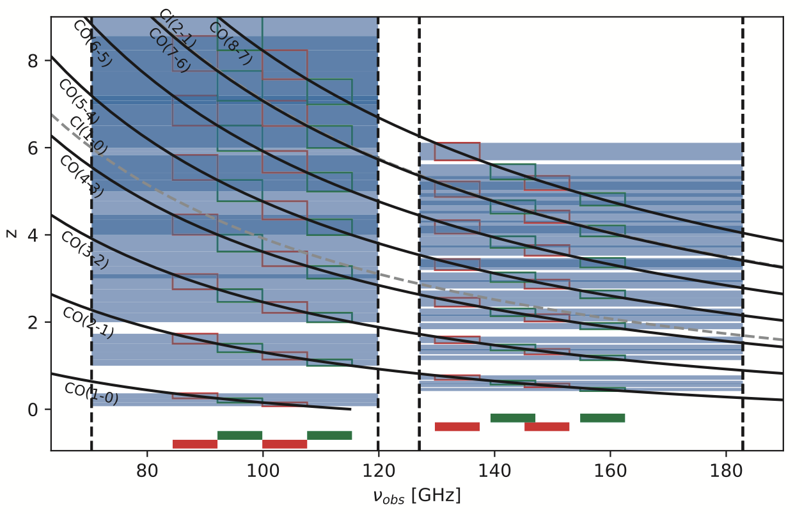
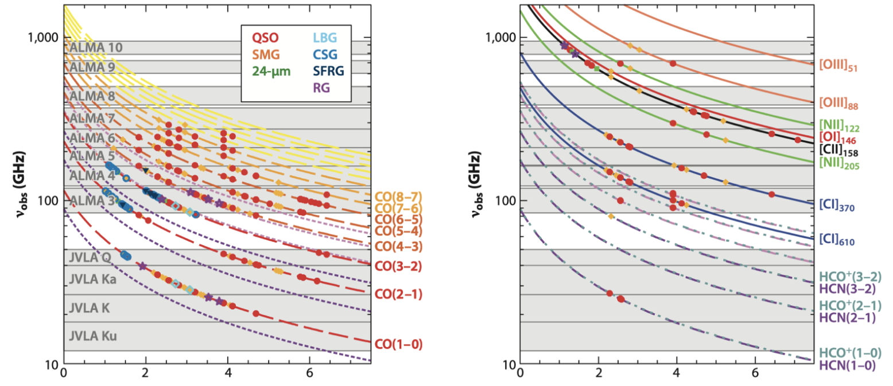
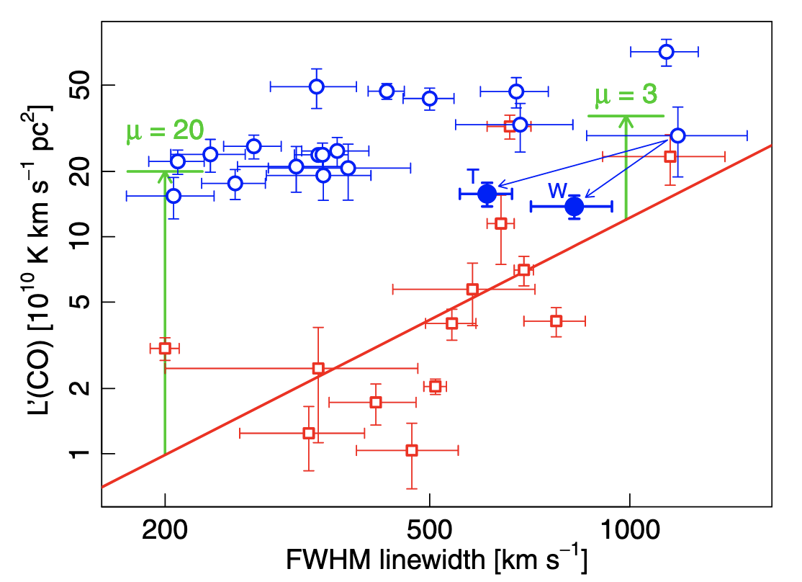

The spectral line coverage:

1. NOEMA dual bands spectral line coverage

2. Possible complementary role from ALMA and VLA

Comparing with ALMARED, the role of ALMARED

1. S250<S350<S500 and S500\>45mJy, 500um risers not a clean way to select z>4 galaxies, why is ALMARED as a z>4 survey?

   

CO10 traces total avaibable cold gas, also maybe intrinsicly more extended than high-J CO, C I, [C II]

The way to select the lensed systems. [Harris+2012, Ivison+2013]

350 risers, S350>115mJy, z~2-3

Future follow-up, SPT sample are easier for ALMA

We need special science for CO10 and continuum at 3mm

Possible to also observe 13CO to break the degeneracy of T_kin and X_co